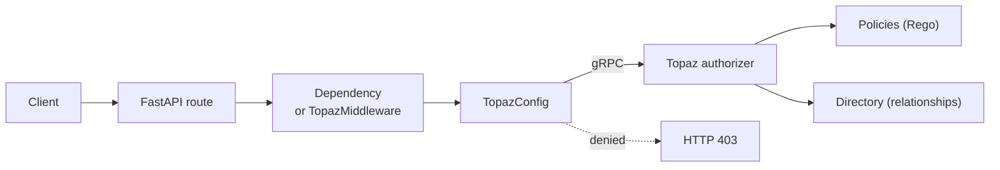

# FastAPI-Topaz

[](https://pypi.org/project/fastapi-topaz/) [](https://pypi.org/project/fastapi-topaz/) [](https://github.com/jmanteau/fastapi-topaz/blob/main/LICENSE) [](https://pypi.org/project/fastapi-topaz/)

FastAPI-Topaz asks a [Topaz](https://www.topaz.sh/) authorizer whether each request may proceed, and returns HTTP 403 Forbidden when the answer is no.

Full documentation: **[jmanteau.github.io/fastapi-topaz](https://jmanteau.github.io/fastapi-topaz)**

## How it works

Your FastAPI app sends the user's identity and the route to Topaz. Topaz evaluates a policy and returns *allowed* or *denied*.



| Component | Role | Source |
| --- | --- | --- |
| `TopazConfig` | Holds the Topaz connection, how to find the user, and the policy root. Create it once at startup. | [`config.py` L143–L222](https://github.com/jmanteau/fastapi-topaz/blob/main/src/fastapi_topaz/config.py#L143-L222) |
| Dependencies | Protect one route at a time with `Depends(...)`. | [`dependencies.py`](https://github.com/jmanteau/fastapi-topaz/blob/main/src/fastapi_topaz/dependencies.py) |
| `TopazMiddleware` | Protects every route in the app, except the paths you exclude. | [`middleware.py` L89–L140](https://github.com/jmanteau/fastapi-topaz/blob/main/src/fastapi_topaz/middleware.py#L89-L140) |

## Requirements

- Python 3.10 or later
- FastAPI 0.100 or later (except 0.137.0 and 0.137.1)
- A running Topaz instance

## Install

```bash
pip install fastapi-topaz
```

## Quick start

This example protects `GET /documents`. Topaz evaluates the policy `myapp.GET.documents` for the user in `request.state.user_id`.

```python
from fastapi import Depends, FastAPI, Request
from fastapi_topaz import (
    AuthorizerOptions,
    Identity,
    IdentityType,
    TopazConfig,
    require_policy_allowed,
)

config = TopazConfig(
    authorizer_options=AuthorizerOptions(url="localhost:8282"),
    policy_path_root="myapp",
    identity_provider=lambda req: Identity(
        type=IdentityType.IDENTITY_TYPE_SUB,
        value=req.state.user_id,
    ),
    policy_instance_name="myapp",
)

app = FastAPI()

@app.get("/documents")
async def list_documents(
    request: Request,
    _: None = Depends(require_policy_allowed(config, "myapp.GET.documents")),
):
    return {"documents": [...]}
```

## Choose a check

Pick the check that matches your question. Not sure which one? Read [Choosing an authorization approach](https://jmanteau.github.io/fastapi-topaz/how-to/choosing-authorization-approach/).

| Question to answer | Use | Source |
| --- | --- | --- |
| May this user call this route? (you name the policy) | `require_policy_allowed()` | [`dependencies.py` L103–L134](https://github.com/jmanteau/fastapi-topaz/blob/main/src/fastapi_topaz/dependencies.py#L103-L134) |
| May this user call this route? (policy name built from the route) | `require_policy_auto()` | [`dependencies.py` L137–L193](https://github.com/jmanteau/fastapi-topaz/blob/main/src/fastapi_topaz/dependencies.py#L137-L193) |
| Does this user have a relation to this object, such as `can_write` on a document? | `require_rebac_allowed()` | [`dependencies.py` L196–L261](https://github.com/jmanteau/fastapi-topaz/blob/main/src/fastapi_topaz/dependencies.py#L196-L261) |
| Does this user have access at every level of a nested path, such as org → project → document? | `require_rebac_hierarchy()` | [`dependencies.py` L422](https://github.com/jmanteau/fastapi-topaz/blob/main/src/fastapi_topaz/dependencies.py#L422) |
| Fetch one object, and return it only if the user may see it | `get_authorized_resource()` | [`dependencies.py` L264](https://github.com/jmanteau/fastapi-topaz/blob/main/src/fastapi_topaz/dependencies.py#L264) |
| Keep only the objects in a list that the user may see | `filter_authorized_resources()` | [`dependencies.py` L344](https://github.com/jmanteau/fastapi-topaz/blob/main/src/fastapi_topaz/dependencies.py#L344) |
| Protect every route without editing each one | `TopazMiddleware` | [`middleware.py` L89](https://github.com/jmanteau/fastapi-topaz/blob/main/src/fastapi_topaz/middleware.py#L89) |

`require_policy_auto()` builds the policy name from the HTTP method and the route template:

| Route | Policy name |
| --- | --- |
| `GET /documents` | `myapp.GET.documents` |
| `GET /documents/{id}` | `myapp.GET.documents.__id` |
| `PUT /users/{user_id}/docs/{doc_id}` | `myapp.PUT.users.__user_id.docs.__doc_id` |

Example of a relationship check: the user must have the `can_write` relation on the document whose ID is in the `{id}` path parameter.

```python
@app.put("/documents/{id}")
async def update_document(
    id: int,
    _: None = Depends(require_rebac_allowed(config, "document", "can_write")),
):
    ...
```

## Production features

Turn each feature on by passing an object to `TopazConfig`. All are optional.

| Feature | What it does | `TopazConfig` argument | Guide |
| --- | --- | --- | --- |
| Decision cache | Reuses recent decisions for a set Time To Live (TTL), so Topaz gets fewer calls. | `decision_cache` | [Reference](https://jmanteau.github.io/fastapi-topaz/reference/api/) |
| Circuit breaker | Stops calling Topaz after repeated failures, then falls back to cached decisions. | `circuit_breaker` | [Circuit breaker](https://jmanteau.github.io/fastapi-topaz/how-to/circuit-breaker/) |
| Audit logging | Writes each decision as a structured JSON log line. | `audit_logger` | [Audit logging](https://jmanteau.github.io/fastapi-topaz/how-to/audit-logging/) |
| Metrics | Exports Prometheus metrics. | `metrics` | [Observability](https://jmanteau.github.io/fastapi-topaz/how-to/observability/) |
| Tracing | Exports OpenTelemetry (OTel) traces. | `tracing` | [Observability](https://jmanteau.github.io/fastapi-topaz/how-to/observability/) |
| Test doubles | Replaces Topaz with fixed rules in unit tests. | — (`fastapi_topaz.testing`) | [Testing](https://jmanteau.github.io/fastapi-topaz/how-to/testing/) |

## Command-line tool

The package installs a `fastapi-topaz` command. Each subcommand reads your app from `module:attribute`.

| Command | What it does |
| --- | --- |
| `generate-policies` | Writes a Rego policy skeleton for each route. |
| `policy-diff` | Lists routes that have no policy, and policies that match no route. |
| `generate-rights-matrix` | Writes a Markdown table of routes and their policies. |
| `policy-map` | Prints which policy each route uses. |
| `check` | Shows which policy a given request URL resolves to. Add `--live` to ask Topaz for the decision. |

```bash
fastapi-topaz policy-diff --app myapp.main:app --policies policies/
```

Full options: [CLI reference](https://jmanteau.github.io/fastapi-topaz/reference/cli/). Source: [`cli.py` L301](https://github.com/jmanteau/fastapi-topaz/blob/main/src/fastapi_topaz/cli.py#L301).

## Terms

| Term | Meaning |
| --- | --- |
| Policy | A rule, written in Rego, that Topaz evaluates to return *allowed* or *denied*. |
| Rego | The policy language of Open Policy Agent (OPA), which Topaz uses. |
| ReBAC | Relationship-Based Access Control. Access depends on how the user relates to an object, for example "owner of document 42". |
| gRPC | The remote procedure call protocol this library uses to talk to Topaz (default port 8282). |
| Identity provider | Your function that reads the current user from the request. |

## Documentation

The documentation follows the [Diátaxis](https://diataxis.fr/) framework.

| Section | Read it when you want to… |
| --- | --- |
| [Tutorials](https://jmanteau.github.io/fastapi-topaz/tutorials/getting-started/) | learn step by step, from zero |
| [How-to guides](https://jmanteau.github.io/fastapi-topaz/how-to/choosing-authorization-approach/) | solve one specific problem |
| [Reference](https://jmanteau.github.io/fastapi-topaz/reference/api/) | look up an exact function, argument, or CLI option |
| [Explanation](https://jmanteau.github.io/fastapi-topaz/explanation/architecture/) | understand the design and the concepts |

Related: [Topaz documentation](https://www.topaz.sh/docs) · [FastAPI documentation](https://fastapi.tiangolo.com/)

## License

Apache 2.0
