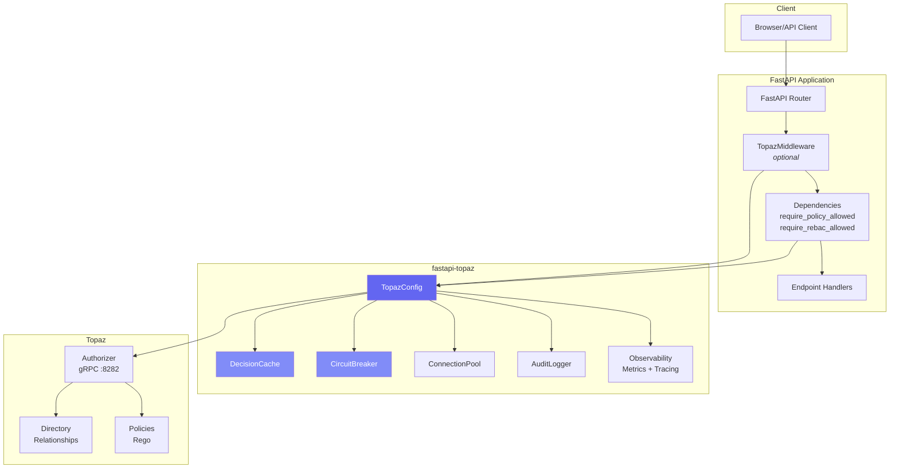
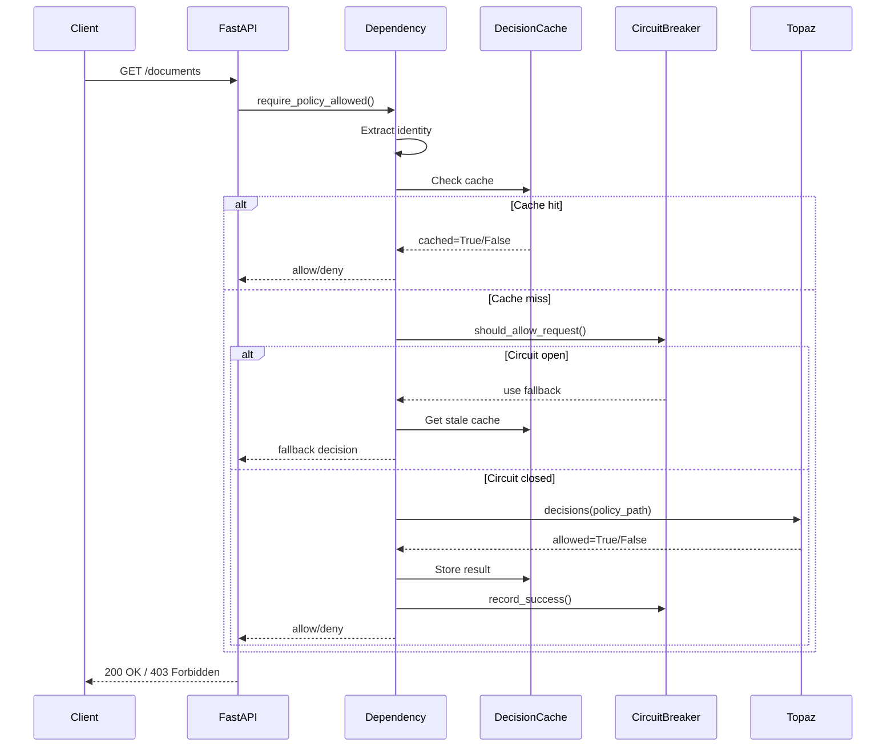
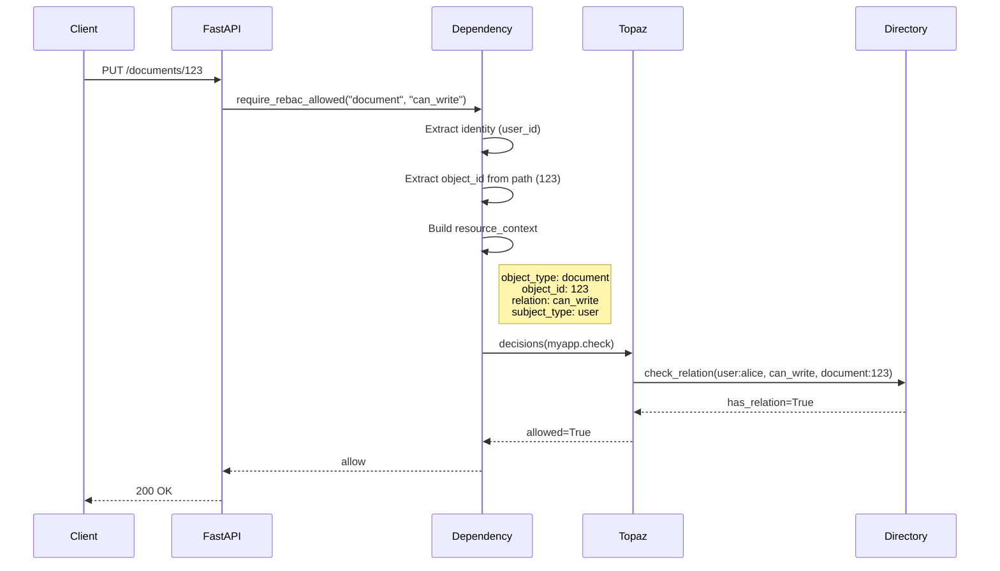
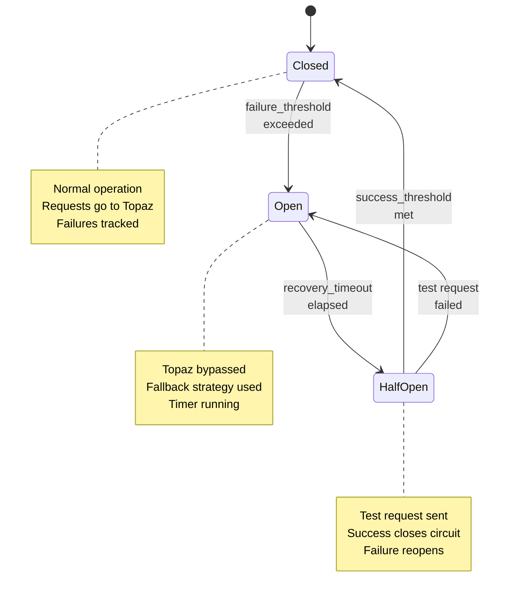
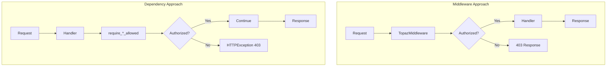
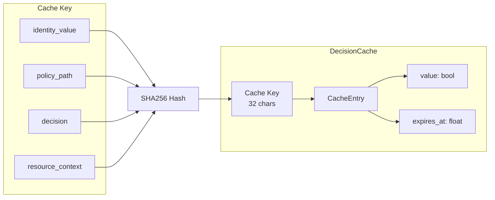

# Architecture and Design Decisions

This document explains the architectural decisions behind fastapi-topaz and how the components work together.

## System Overview



## Request Flow

### Policy Check Flow

When you use `require_policy_allowed()`, this is what happens:



### ReBAC Check Flow

When you use `require_rebac_allowed()`, the flow includes relationship checking:



### Circuit Breaker State Machine

The circuit breaker protects against Topaz failures:



### Middleware vs Dependencies

fastapi-topaz offers two approaches to authorization:



| Aspect | Middleware | Dependencies |
|--------|------------|--------------|
| Scope | Global (all routes) | Per-endpoint |
| Control | Less granular | Fine-grained |
| Testing | Harder to mock | Easy to override |
| Use case | Uniform policy | Mixed policies |

## Why Dependencies Over Decorators?

FastAPI's dependency injection is the native pattern:

```python
@router.put("/documents/{id}")
async def update_document(
    id: int,
    request: Request,
    _: None = Depends(require_rebac_allowed(config, "document", "can_write")),
):
    ...
```

Benefits:

| Benefit | Description |
|---------|-------------|
| Explicit | Authorization visible in function signature |
| Native | Uses FastAPI's standard pattern |
| Testable | Easy mock with `dependency_overrides` |
| Type-safe | Full IDE support |
| Simple | No signature magic needed |

## Policy Path Convention

fastapi-topaz uses a convention for policy paths:

```
{policy_root}.{METHOD}.{path.segments}
```

Examples:

| Route | Policy Path |
|-------|-------------|
| `GET /documents` | `myapp.GET.documents` |
| `POST /documents` | `myapp.POST.documents` |
| `GET /documents/123` | `myapp.GET.documents.__id` |
| `PUT /users/alice/settings` | `myapp.PUT.users.__id.settings` |

Path parameters are converted to `__paramname`.

## Caching Architecture



Cache behavior:
- Caches decisions per `(user, policy_path, decision, resource_context)`
- Automatically expires entries after TTL
- Evicts oldest entries when `max_size` is reached
- Thread-safe with async lock

## Error Handling

All authorization failures result in `HTTPException(403)`:

```python
raise HTTPException(
    status_code=status.HTTP_403_FORBIDDEN,
    detail=f"Access denied: {policy_path}",
)
```

To customize error handling, wrap the dependency:

```python
def custom_auth_check(config, policy_path):
    base_dep = require_policy_allowed(config, policy_path)

    async def wrapper(request: Request):
        try:
            await base_dep(request)
        except HTTPException:
            raise HTTPException(
                status_code=403,
                detail={"error": "unauthorized", "required_permission": policy_path}
            )

    return wrapper
```

## Performance Considerations

### Decision Caching

Enable optional TTL-based caching to avoid repeated authorization checks:

```python
cache = DecisionCache(ttl_seconds=60, max_size=1000)

config = TopazConfig(
    ...
    decision_cache=cache,
)
```

When to use:
- High-traffic endpoints with repeated checks
- Authorization decisions don't change frequently
- NOT for real-time permission changes

### Concurrent Bulk Authorization

`filter_authorized_resources()` uses `asyncio.gather()` for concurrent checks:

```python
config = TopazConfig(
    ...
    max_concurrent_checks=20,
)
```

Performance impact:
- 10 items with 50ms latency: ~50ms (concurrent) vs ~500ms (sequential)
- Semaphore prevents overwhelming the authorizer

### Connection Pooling

For high-throughput applications, use connection pooling:

```python
pool = ConnectionPool(min_connections=2, max_connections=10)

config = TopazConfig(
    ...
    connection_pool=pool,
)
```

Benefits:
- Reuses gRPC connections
- Reduces connection overhead
- Automatic health checking

## Comparison with Alternatives

| Feature | fastapi-topaz | casbin | fastapi-permissions |
|---------|---------------|--------|---------------------|
| Policy Engine | Topaz/OPA | Casbin | Custom |
| Policy Language | Rego | Model-based | Python |
| ReBAC Support | Yes | Limited | No |
| FastAPI Integration | Native | Adapter | Native |
| Distributed | Yes (edge) | No | No |
| Caching | Built-in | External | No |
| Circuit Breaker | Built-in | No | No |

## See Also

- [Authorization Models](authorization-models.md) - RBAC/ABAC/ReBAC concepts
- [API Reference](../reference/api.md) - Complete API documentation
- [Topaz Documentation](https://www.topaz.sh/docs)
