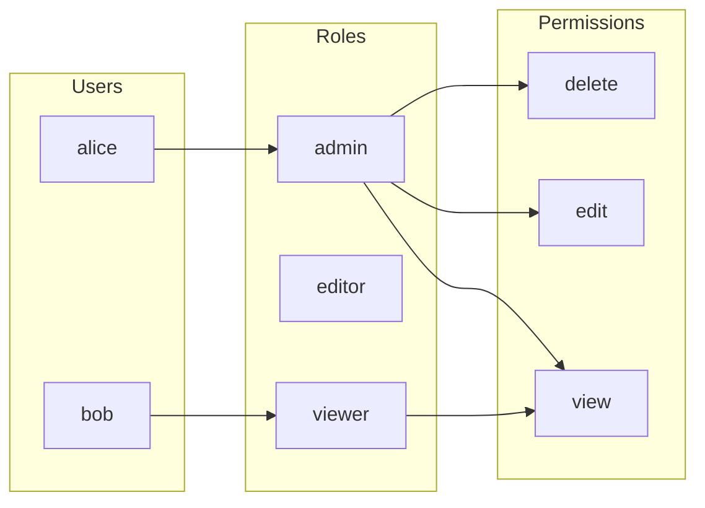
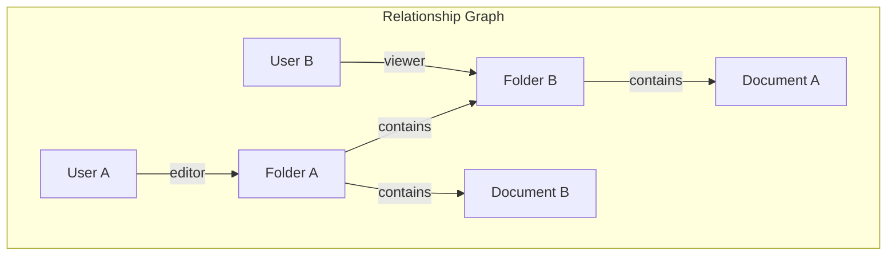

# Authorization Models: RBAC, ABAC, and ReBAC

Understanding the three main authorization models and when to use each.

## Core Concepts

Before diving into each model, understand the three essential components of any authorization system:

| Component | Description | Example |
|-----------|-------------|---------|
| **Action** | The activity to be performed (the permission being granted or withheld) | `view`, `edit`, `delete` |
| **Identity** | An authenticated subject (user or system) requesting authorization | `user:alice`, `service:api-gateway` |
| **Resource** | The object the action is performed on | `document:123`, `folder:reports` |

These three components form an **authorization policy** - the set of rules determining whether an identity can perform an action on a resource.

```
Authorization Decision = Policy(Identity, Action, Resource)
```

## Quick Reference

A common question: "If I have role-based access but only allow editing resources I own, is that ABAC?"

No. This is a **hybrid of RBAC and ReBAC**:

- **RBAC component**: Role determines the general capability ("editors can edit documents")
- **ReBAC component**: Ownership relationship restricts to specific resources ("owner of this document")

It's not ABAC because ownership is a **relationship** between user and resource, not an **attribute**. ABAC uses contextual attributes like time of day, geographic location, department, or document classification level.

| Model | Question Answered |
|-------|-------------------|
| RBAC | "Can editors edit documents?" |
| ReBAC | "Is this user the owner of this document?" |
| ABAC | "Can this user edit internal documents during business hours from approved locations?" |

In fastapi-topaz, combine models in a **single Rego policy** (see [Combining Models](#combining-models) below).

## RBAC (Role-Based Access Control)

RBAC is the most straightforward authorization model: define **permissions** that correspond to actions, group permissions into **roles**, and assign roles to users.



### How it works

1. **Permissions** map to actions: `view`, `edit`, `delete`
2. **Roles** group permissions: `viewer` has `view`, `editor` has `view` + `edit`, `admin` has all three
3. **Users** are assigned roles - access is granted if their role contains the required permission

This indirection allows modifying role permissions without redefining the entire model.

### Strengths

- Simple to understand, modify, and audit
- Clear mapping: user → role → permission
- Best for relatively static permission structures

### Weaknesses

- **Role explosion**: Large organizations may need hundreds of roles to cover all scenarios
- No resource-level permissions ("can edit THIS document")
- Static - doesn't consider context (time, location)

### In fastapi-topaz

Define roles and permissions in `data.json`:

```json
{
  "roles": {
    "viewer": { "perms": { "view": true } },
    "editor": { "perms": { "view": true, "edit": true } },
    "admin": { "perms": { "view": true, "edit": true, "delete": true } }
  }
}
```

Rego policy checks the mapping:

```rego
package myapp

user_roles := input.user.attributes.roles
action := input.resource.action

default allowed := false

allowed if {
    some role in user_roles
    data.roles[role].perms[action]
}
```

FastAPI dependency:

```python
Depends(require_policy_allowed(config, "myapp.DELETE.documents"))
```

## ABAC (Attribute-Based Access Control)

ABAC uses **attributes** of the subject, resource, or environment to make decisions. While roles are static, attributes produce fine-grained, dynamic authorization.

```
Decision = f(user_attrs, resource_attrs, action, environment)
```

### How it works

Unlike RBAC which asks "does user have role X?", ABAC considers dynamic values:

- **User attributes**: location, department, clearance level
- **Resource attributes**: classification, sensitivity, owner
- **Environment**: time of day, IP address, device type

### Strengths

- Fine-grained control based on any attribute
- Dynamic - considers runtime context
- No role explosion
- Compliance-friendly (geographic restrictions, time-based access)

### Weaknesses

- More complex to design and debug
- Harder to audit ("why was access denied?")
- Must handle all potential attribute values or risk unexpected behavior

### In fastapi-topaz

Define allowed values in `data.json`:

```json
{
  "allowedLocations": ["USA", "Canada", "France", "Germany"]
}
```

Rego policy checks attributes:

```rego
package myapp

user_location := input.user.properties.location

default allowed := false

allowed if {
    some loc in data.allowedLocations
    loc == user_location
}
```

Provide attributes via resource context:

```python
def resource_context_provider(request: Request) -> dict:
    return {
        "user_location": get_location_from_ip(request),
        "time_of_day": datetime.now().hour,
    }

config = TopazConfig(resource_context_provider=resource_context_provider, ...)
```

## ReBAC (Relationship-Based Access Control)

ReBAC describes a **relationship graph** between subjects and objects. Authorization is determined by checking whether a relationship path exists.

This is **policy-as-data**: the policy logic is derived from the graph structure itself, not just code.

### Hierarchical Example

ReBAC excels at modeling hierarchies. Consider folders containing documents:



**Permission inheritance:**

- User A is `editor` of Folder A → can edit Folder A, Folder B, Document A, Document B (all contained)
- User B is `viewer` of Folder B → can view Folder B and Document A only

### Strengths

- Fine-grained, resource-level permissions
- Natural for sharing/collaboration (Google Docs model)
- Handles complex hierarchies (org → team → project → document)
- Scales to billions of relationships (Google Zanzibar)

### Weaknesses

- Requires relationship storage (directory)
- Graph complexity can make debugging harder
- Relationship management overhead

### In fastapi-topaz

```python
@app.put("/documents/{id}")
async def update(
    id: int,
    _: None = Depends(require_rebac_allowed(config, "document", "can_write")),
):
    ...
```

```rego
package myapp

allowed if {
    ds.check_permission({
        "subject": {"id": input.identity.value},
        "permission": "can-edit",
        "object": {"type": "document", "id": input.resource.id},
    })
}
```

## Comparison Table

| Aspect | RBAC | ABAC | ReBAC |
|--------|------|------|-------|
| Question answered | "Can admin delete?" | "Can editor delete internal docs during business hours?" | "Can Alice delete document-123?" |
| Granularity | Role level | Attribute level | Resource level |
| Complexity | Low | Medium-High | Medium |
| Flexibility | Low | High | Medium |
| Best for | Simple apps, enterprise roles | Complex rules, compliance | Sharing, collaboration |
| fastapi-topaz | `require_policy_allowed` | `require_policy_allowed` + context | `require_rebac_allowed` |

## Combining Models

Real applications combine models. With Topaz, you can write a **single policy** that applies all three:

```rego
package myapp.edit

user_attrs := input.user.properties.attributes

# RBAC: Admins can edit any resource - no other conditions
allowed if {
    "admin" in user_attrs.roles
}

# RBAC + ABAC: Editors can edit only from allowed locations
allowed if {
    "editor" in user_attrs.roles
    some loc in data.allowedLocations
    loc == user_attrs.location
}

# ReBAC: User with explicit can-edit permission (regardless of role/location)
allowed if {
    ds.check_permission({
        "subject": {"id": input.identity.value},
        "permission": "can-edit",
        "object": {"type": "document", "id": input.resource.id},
    })
}
```

This policy enforces:

1. **Admins** can edit anything (RBAC)
2. **Editors** can edit only from approved locations (RBAC + ABAC)
3. **Anyone** with explicit `can-edit` relationship can edit (ReBAC)

FastAPI only needs one dependency - the policy handles the combined logic:

```python
@app.put("/documents/{id}")
async def update_document(
    id: int,
    _: None = Depends(require_policy_allowed(config, "myapp.edit")),
):
    ...
```

## See Also

- [Architecture](architecture.md) - Library design decisions
- [API Reference](../reference/api.md) - Dependencies documentation
- [Google Zanzibar Paper](https://research.google/pubs/pub48190/) - ReBAC foundation
