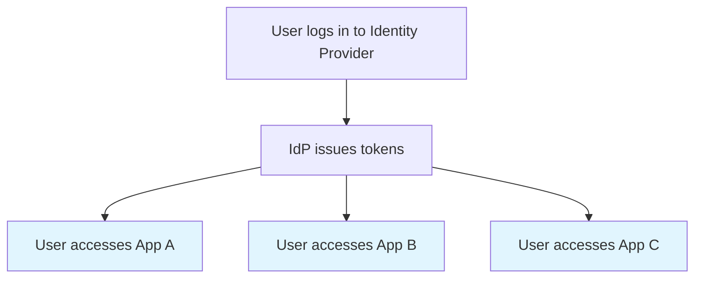
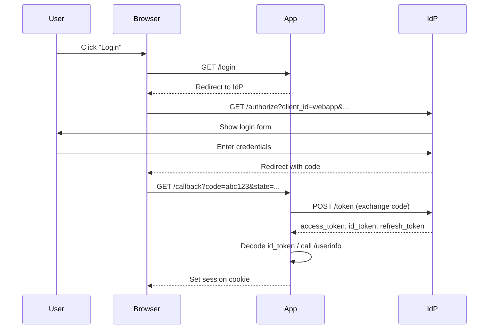

# SSO Concepts: OAuth2 and OpenID Connect

Understanding Single Sign-On, OAuth2, and OIDC for authentication.

## What is SSO?

Single Sign-On (SSO) allows users to authenticate once and access multiple applications without re-entering credentials.



## OAuth2 vs OpenID Connect

| Protocol | Purpose | Use Case |
|----------|---------|----------|
| OAuth2 | Authorization | "Can this app access my photos?" |
| OIDC | Authentication | "Who is this user?" |

OpenID Connect (OIDC) is built on top of OAuth2, adding identity layer.

## The OIDC Flow

### Authorization Code Flow (Recommended for Web Apps)



## Tokens

### ID Token

JWT containing user identity claims. Decoded by the application.

```json
{
  "iss": "https://auth.example.com",
  "sub": "user-123-uuid",
  "aud": "webapp",
  "exp": 1704067200,
  "iat": 1704063600,
  "email": "alice@example.com",
  "name": "Alice Smith",
  "email_verified": true
}
```

Key claims:

| Claim | Description |
|-------|-------------|
| iss | Issuer (IdP URL) |
| sub | Subject (unique user ID) |
| aud | Audience (client ID) |
| exp | Expiration timestamp |
| iat | Issued at timestamp |

### Access Token

Used to call APIs. Often opaque (not a JWT). Short-lived.

### Refresh Token

Used to obtain new access tokens without re-authentication. Long-lived.

## Session Management

After OIDC flow completes, store user identity in session:

```python
@app.get("/auth/callback")
async def callback(request: Request):
    token = await oauth.authentik.authorize_access_token(request)
    userinfo = token.get('userinfo')

    request.session['user'] = {
        'sub': userinfo['sub'],
        'email': userinfo['email'],
        'name': userinfo.get('name', userinfo['email']),
    }

    return RedirectResponse(url="/")
```

### Cookie-Based Sessions

```python
app.add_middleware(
    SessionMiddleware,
    secret_key=os.environ['SESSION_SECRET'],
    max_age=86400,  # 24 hours
    https_only=True,
    same_site='lax',
)
```

### Session Data

The browser stores a signed cookie containing user identity:

```
Cookie: session=eyJ...
```

When decoded, it contains:

```json
{
  "user": {
    "sub": "user-123",
    "email": "alice@example.com"
  }
}
```

## Integration with Authorization

Authentication provides the identity. Authorization uses it.

```python
def identity_provider(request: Request) -> Identity:
    """Extract identity from OIDC session."""
    user = request.session.get('user')

    if not user:
        return Identity(type=IdentityType.IDENTITY_TYPE_NONE)

    return Identity(
        type=IdentityType.IDENTITY_TYPE_SUB,
        value=user['sub'],
    )

topaz_config = TopazConfig(
    identity_provider=identity_provider,
    ...
)
```

## Identity Providers

### Authentik

Open-source IdP with rich features.

```python
oauth.register(
    name='authentik',
    server_metadata_url='https://authentik.example.com/application/o/app/.well-known/openid-configuration',
    client_id='...',
    client_secret='...',
)
```

### Keycloak

Enterprise-grade Java-based IdP.

```python
oauth.register(
    name='keycloak',
    server_metadata_url='https://keycloak.example.com/realms/myrealm/.well-known/openid-configuration',
)
```

### Auth0

Cloud IdP with extensive integrations.

```python
oauth.register(
    name='auth0',
    server_metadata_url='https://tenant.auth0.com/.well-known/openid-configuration',
)
```

## Security Considerations

| Concern | Mitigation |
|---------|------------|
| Token theft | Short expiration, HTTPS only |
| CSRF | State parameter in OIDC flow |
| Session fixation | Regenerate session on login |
| XSS | HttpOnly cookies |
| Open redirect | Validate redirect URIs |

### State Parameter

Prevents CSRF attacks by ensuring the callback matches the request:

```python
# Login: Generate random state, store in session
state = secrets.token_urlsafe(32)
request.session['oauth_state'] = state

# Callback: Verify state matches
if request.query_params['state'] != request.session['oauth_state']:
    raise HTTPException(400, "Invalid state")
```

Authlib handles this automatically.

## Logout

### Application Logout

Clear local session:

```python
@app.get("/logout")
async def logout(request: Request):
    request.session.clear()
    return RedirectResponse(url="/")
```

### Single Logout (SLO)

Also log out from IdP:

```python
@app.get("/logout")
async def logout(request: Request):
    request.session.clear()
    return RedirectResponse(url=f"{OIDC_ISSUER}/logout?post_logout_redirect_uri={APP_URL}")
```

## See Also

- [Authentication Tutorial](../tutorials/example-app/02-authentication.md) - Step-by-step guide
- [OIDC Reference](../reference/oidc.md) - Configuration options
- [Authentik Setup](../how-to/example-app/authentik-setup.md) - IdP configuration
