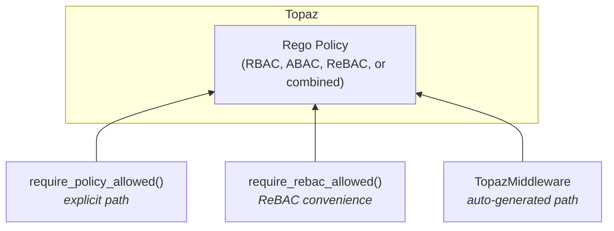

# How to Choose the Right Authorization Approach

fastapi-topaz provides multiple ways to add authorization. This guide helps you choose the right approach for your use case.

## Key Insight: The Policy Does the Work

All authorization in fastapi-topaz flows through **Rego policies** in Topaz. The Python functions are just different ways to call those policies.



**`require_policy_allowed()`** is the most powerful - your Rego policy can check roles, attributes, relationships, or all three. The other functions are conveniences:

- `require_rebac_allowed()` - sets up resource context for relationship checks
- `require_policy_auto()` / `TopazMiddleware` - auto-generates policy paths from routes

## Decision Matrix

| Scenario | Recommended Approach |
|----------|---------------------|
| Any authorization (RBAC/ABAC/ReBAC/combined) | `require_policy_allowed()` |
| Auto-generate policy path from route | `require_policy_auto()` |
| ReBAC with less boilerplate | `require_rebac_allowed()` |
| Fetch resource and check permission | `get_authorized_resource()` |
| Filter list by user permissions | `filter_authorized_resources()` |
| Check permission without raising 403 | `config.is_allowed()` |
| Check multiple relations at once | `config.check_relations()` |
| Protect all routes globally | `TopazMiddleware` |

## Quick Reference

### require_policy_allowed()

**Use when:** You want full control. This is the **foundation** - your Rego policy can implement any authorization model (RBAC, ABAC, ReBAC, or combined).

```python
@app.put("/documents/{id}")
async def update_document(
    id: int,
    _: None = Depends(require_policy_allowed(config, "myapp.PUT.documents")),
):
    # Policy decides: check role? check location? check ownership? all three?
    ...
```

**Best for:** Complex authorization, combined models, when you want logic in Rego not Python.

---

### require_policy_auto()

**Use when:** You want policy paths auto-generated from HTTP method + route.

```python
@app.get("/documents/{id}")
async def get_document(
    id: int,
    _: None = Depends(require_policy_auto(config)),  # Auto: myapp.GET.documents.__id
):
    ...
```

**Best for:** Consistent policy naming, REST APIs, reducing boilerplate.

---

### require_rebac_allowed()

**Use when:** Permission depends on the user's relationship to a specific resource.

```python
@app.put("/documents/{id}")
async def update_document(
    id: int,
    _: None = Depends(require_rebac_allowed(config, "document", "can_write")),
):
    # Only users who CAN_WRITE this specific document reach here
    ...
```

**Best for:** Document ownership, shared resources, fine-grained access.

---

### get_authorized_resource()

**Use when:** You need to fetch a resource AND check permission in one step.

```python
def fetch_document(request: Request, db) -> Document | None:
    return db.query(Document).get(request.path_params["id"])

@app.get("/documents/{id}")
async def get_document(
    document: Document = Depends(
        get_authorized_resource(config, fetch_document, "document", "can_read")
    ),
):
    # document is pre-fetched and authorized
    return document
```

**Best for:** Avoiding double database queries, combining fetch + auth.

---

### filter_authorized_resources()

**Use when:** You need to filter a list to only items the user can access.

```python
@app.get("/documents")
async def list_documents(
    filter_fn: Callable = Depends(
        filter_authorized_resources(config, "document", "can_read")
    ),
    db: Session = Depends(get_db),
):
    all_docs = db.query(Document).all()
    return await filter_fn(all_docs)  # Only docs user can read
```

**Best for:** List endpoints, search results, bulk filtering.

---

### config.is_allowed()

**Use when:** You want to check permission without raising HTTPException.

```python
@app.get("/documents/{id}")
async def get_document(id: int, request: Request):
    doc = await fetch_document(id)

    # Check permissions for UI hints
    can_edit = await config.is_allowed(
        request,
        policy_path="myapp.PUT.documents",
        resource_context={"id": str(id)},
    )
    can_delete = await config.is_allowed(
        request,
        policy_path="myapp.DELETE.documents",
        resource_context={"id": str(id)},
    )

    return {
        "document": doc,
        "permissions": {"can_edit": can_edit, "can_delete": can_delete},
    }
```

**Best for:** UI permission hints, conditional features, non-blocking checks.

---

### config.check_relations()

**Use when:** You need to check multiple ReBAC relations at once.

```python
@app.get("/documents/{id}")
async def get_document(id: int, request: Request):
    doc = await fetch_document(id)

    permissions = await config.check_relations(
        request,
        object_type="document",
        object_id=str(id),
        relations=["can_read", "can_write", "can_delete", "can_share"],
    )
    # {"can_read": True, "can_write": True, "can_delete": False, "can_share": False}

    return {"document": doc, "permissions": permissions}
```

**Best for:** Fetching all permissions in one call, rich UI permission models.

---

### TopazMiddleware

**Use when:** You want to protect all routes globally with auto-generated policy paths.

```python
from fastapi_topaz import TopazMiddleware

app.add_middleware(TopazMiddleware, config=config, exclude_paths=[r"^/health$"])
```

**Best for:** Uniform protection, microservices, APIs where all routes need auth.

---

## Combining Approaches

Real applications often combine multiple approaches:

```python
# Global protection via middleware
app.add_middleware(TopazMiddleware, config=config, exclude_paths=[r"^/public/"])

# Explicit ReBAC for sensitive operations
@app.delete("/documents/{id}")
async def delete_document(
    id: int,
    # Middleware already checked myapp.DELETE.documents.__id
    # Now also check ReBAC ownership
    _: None = Depends(require_rebac_allowed(config, "document", "can_delete")),
):
    ...

# Non-blocking permission checks for UI
@app.get("/documents/{id}")
async def get_document(id: int, request: Request):
    doc = await fetch_document(id)
    permissions = await config.check_relations(
        request, "document", str(id),
        relations=["can_write", "can_delete", "can_share"],
    )
    return {"document": doc, "permissions": permissions}
```

## See Also

- [API Reference](../reference/api.md) - Complete function documentation
- [Architecture](../explanation/architecture.md) - Design decisions
- [Authorization Models](../explanation/authorization-models.md) - RBAC/ABAC/ReBAC concepts
