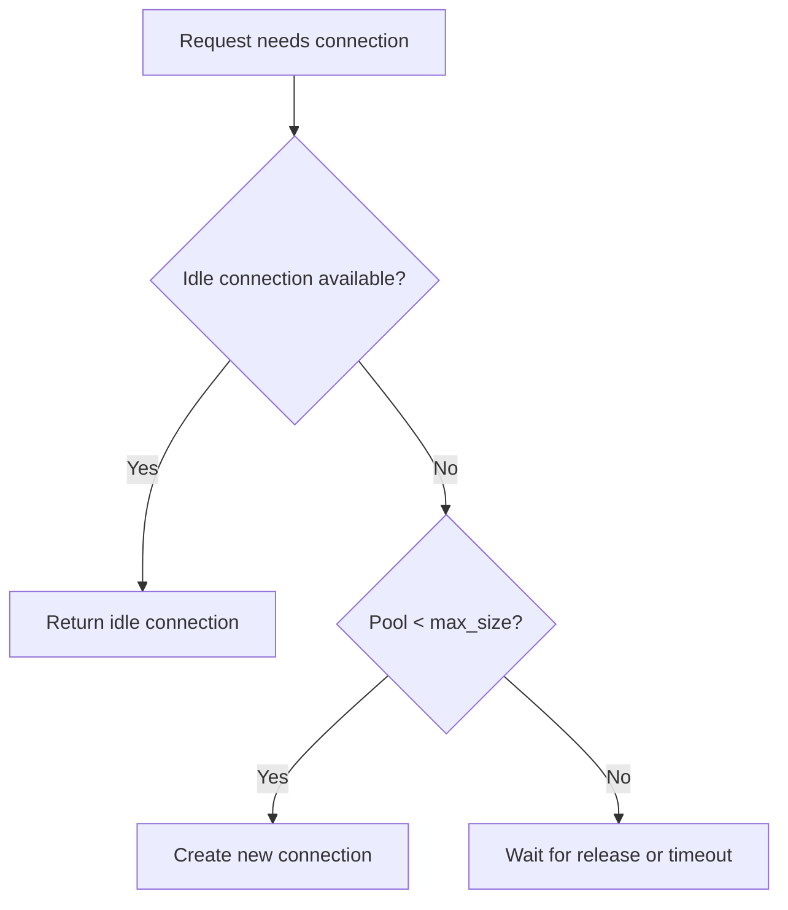

# How to Configure Connection Pooling

Efficient management of gRPC connections to Topaz for high-throughput applications.

## Basic Configuration

```python
from fastapi_topaz import TopazConfig, ConnectionPool

config = TopazConfig(
    authorizer_options=AuthorizerOptions(url="localhost:8282"),
    policy_path_root="myapp",
    identity_provider=get_identity,
    policy_instance_name="myapp",

    connection_pool=ConnectionPool(
        min_connections=2,
        max_connections=10,
        acquire_timeout=5.0,
        connection_timeout=10.0,
        max_idle_time=300,
        idle_check_interval=60,
        health_check_interval=30,
        health_check_timeout=5.0,
        eager_init=False,
    ),
)
```

## Pool Behavior

### Connection Lifecycle



### Acquisition Flow

```python
# Automatic via context manager
async with pool.acquire() as conn:
    result = await conn.decisions(...)
# Connection returned to pool

# Or explicit
conn = await pool.acquire()
try:
    result = await conn.decisions(...)
finally:
    await pool.release(conn)
```

## Multi-Process Configuration

For Gunicorn/Uvicorn workers, each process has its own pool:

```python
# With 4 workers, each with max 10 connections
# Total to Topaz: up to 40 connections

connection_pool=ConnectionPool(
    min_connections=1,
    max_connections=5,
)
```

### Startup/Shutdown Hooks

```python
@app.on_event("startup")
async def startup():
    await config.connection_pool.initialize()

@app.on_event("shutdown")
async def shutdown():
    await config.connection_pool.close()
```

## Health Check Integration

```python
@app.get("/health")
async def health():
    pool_status = config.connection_pool.status()

    return {
        "status": "ok" if pool_status.healthy else "degraded",
        "connection_pool": {
            "total": pool_status.total,
            "idle": pool_status.idle,
            "busy": pool_status.busy,
            "healthy": pool_status.healthy_connections,
            "max": pool_status.max_connections,
        }
    }
```

## Configuration Reference

| Parameter | Type | Default | Description |
|-----------|------|---------|-------------|
| min_connections | int | 2 | Minimum warm connections |
| max_connections | int | 10 | Maximum connections |
| acquire_timeout | float | 5.0 | Wait timeout for connection |
| connection_timeout | float | 10.0 | Establishment timeout |
| max_idle_time | float | 300.0 | Seconds before closing idle |
| idle_check_interval | float | 60.0 | Interval for idle checks |
| health_check_interval | float | 30.0 | Interval for health checks |
| health_check_timeout | float | 5.0 | Health check timeout |
| eager_init | bool | False | Create min_connections at startup |
| retry_on_failure | bool | True | Retry failed creation |
| max_retries | int | 3 | Max creation retries |

## Metrics

Pool metrics exposed via observability:

```prometheus
topaz_pool_connections_total{state="idle"} 3
topaz_pool_connections_total{state="busy"} 7
topaz_pool_acquisitions_total 15234
topaz_pool_timeouts_total 12
topaz_pool_acquire_latency_seconds_bucket{le="0.001"} 14500
```

## See Also

- [Observability](observability.md) - Pool metrics
- [Circuit Breaker](circuit-breaker.md) - Connection failure handling
