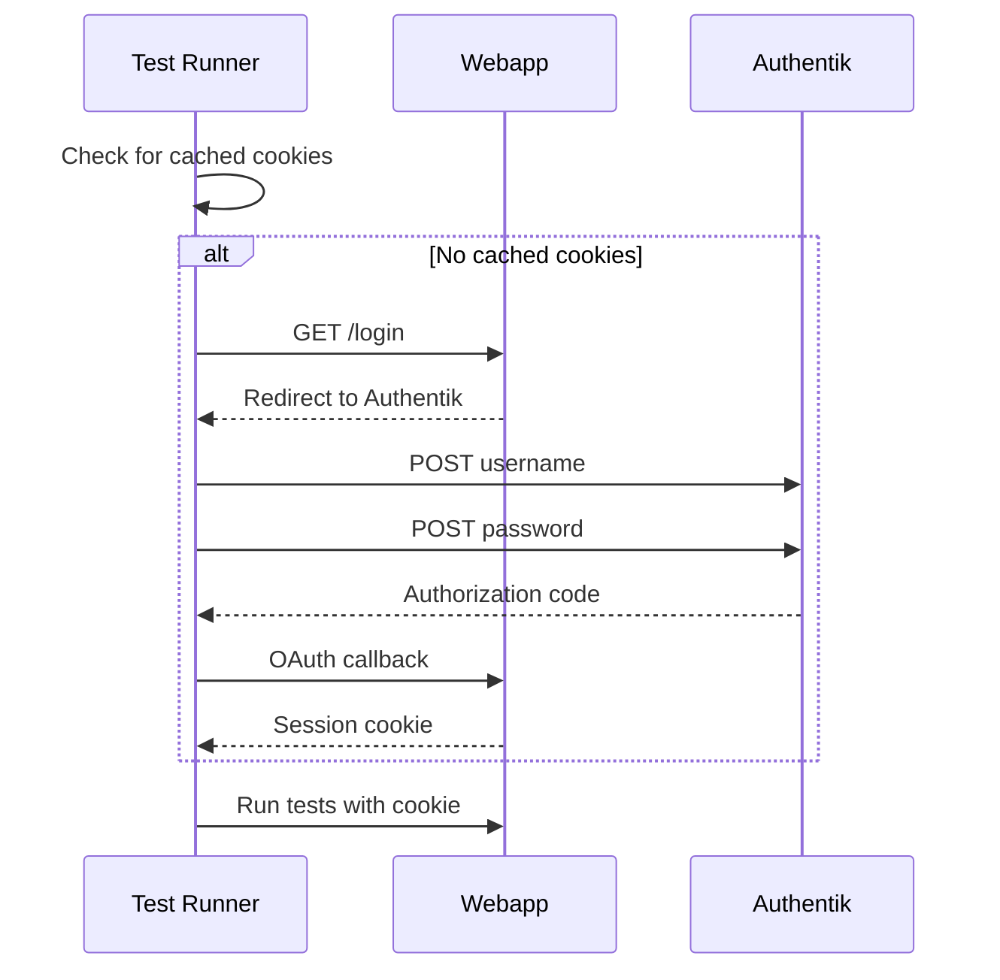

# How to Run Integration Tests

End-to-end integration tests using HTTP-based authentication (no browser required).

## Overview

The integration tests validate complete user workflows against a running stack with real OIDC authentication.

**Key features:**
- HTTP-only OIDC flow (no browser automation)
- Standalone package with minimal dependencies
- Automatic service health checks
- Cookie caching for faster test runs

## Quick Start

```bash
cd integration-tests

# Complete setup and run tests
make setup
make test
```

## Authentication Flow



## Test Scenarios

| Scenario | Tests | Description |
|----------|-------|-------------|
| alice | 15 | Document and folder management, sharing |
| bob | 8 | Own resources, reading shared/public docs |
| sharing | 9 | Document sharing with read/write permissions |
| auth-failures | 9 | Unauthorized access denials |
| public | 8 | Public document accessibility |

## Commands

### Running Tests

```bash
make test              # All tests
make test-alice        # Alice's workflow
make test-bob          # Bob's workflow
make test-sharing      # Document sharing
make test-failures     # Security tests
make test-public       # Public documents
```

### Cookie Management

```bash
make cookies           # Fetch session cookies
make cookies-show      # Display cookies
make cookies-clear     # Clear cached cookies

# Or use the helper script
python tests/auth_helper.py
```

### Service Management

```bash
make check-services    # Verify services are running
make start-services    # Start all services
make stop-services     # Stop services
make create-users      # Create test users
```

## Configuration

### Environment Variables

```bash
# Service URLs (defaults shown)
WEBAPP_URL="http://localhost:8000"
AUTHENTIK_URL="http://localhost:9000"

# Session cookies (auto-fetched if missing)
ALICE_SESSION_COOKIE="<cookie>"
BOB_SESSION_COOKIE="<cookie>"
CHARLIE_SESSION_COOKIE="<cookie>"
```

## Project Structure

```
integration-tests/
├── pyproject.toml           # Standalone package config
├── run_tests.py             # Test runner with auth
├── Makefile                 # Convenience commands
└── tests/
    ├── conftest.py          # Fixtures with HTTP auth
    ├── auth_helper.py       # OIDC authenticator
    ├── test_scenario_alice.py
    ├── test_scenario_bob.py
    ├── test_scenario_sharing.py
    ├── test_scenario_authorization_failures.py
    └── test_scenario_public_documents.py
```

## Adding New Tests

```python
# tests/test_scenario_new.py
from tests.conftest import AuthenticatedClient

def test_new_feature(alice_client: AuthenticatedClient):
    """Test description."""
    response = alice_client.post("/api/resource", json={"data": "value"})
    assert response.status_code == 201
```

## Troubleshooting

### Services Not Running

```bash
# Start services
cd /path/to/topaz-poc
make up
make check-health
```

### Authentication Fails

1. Verify users exist in Authentik (http://localhost:9000)
2. Check credentials (default password: `password`)
3. Verify OIDC provider configuration

```bash
# Debug auth
python tests/auth_helper.py

# Check logs
docker-compose logs authentik-server
docker-compose logs webapp
```

### Expired Cookies

```bash
# Re-fetch cookies
python run_tests.py --get-cookies
export $(cat .env.test | xargs)
```

## CI/CD Integration

```yaml
# .github/workflows/integration.yml
name: Integration Tests

on: [push, pull_request]

jobs:
  integration-tests:
    runs-on: ubuntu-latest
    steps:
      - uses: actions/checkout@v4

      - name: Start services
        run: docker-compose up -d

      - name: Wait for services
        run: sleep 30

      - name: Setup users
        run: |
          cd terraform/authentik-webapp
          terraform init && terraform apply -auto-approve

      - name: Run tests
        run: |
          cd integration-tests
          uv pip install -e .
          python run_tests.py
```

## HTTP vs Browser-Based Testing

| Aspect | HTTP-based | Browser-based |
|--------|------------|---------------|
| Speed | ~8s total | ~45s total |
| Dependencies | httpx, pytest | Playwright, chromium |
| CI/CD | Works everywhere | Needs display config |
| Reliability | Stable | Timing-sensitive |
| Resource usage | Minimal | Heavy |
