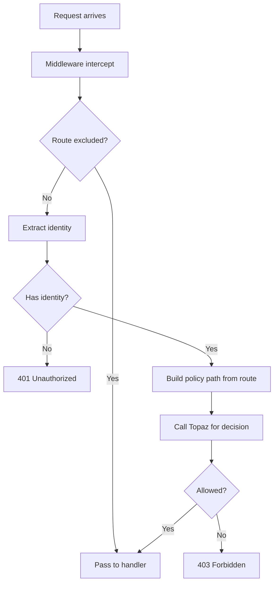

# How to Configure Authorization Middleware

Global request-level authorization that runs before route handlers.

## Basic Configuration

```python
from fastapi import FastAPI
from fastapi_topaz import AuthorizationMiddleware

app = FastAPI()

app.add_middleware(
    AuthorizationMiddleware,
    config=topaz_config,
    exclude=["/health", "/metrics", "/docs", "/openapi.json"],
)
```

## How It Works



## Exclude Patterns

### Exact Path

```python
exclude=["/health", "/login", "/callback"]
```

### Prefix Match

```python
exclude=["/public/"]  # Trailing slash = prefix
# Matches: /public/foo, /public/bar/baz
```

### Regex Pattern

```python
exclude=[
    re.compile(r"^/api/v1/public/.*"),
    re.compile(r".*\.(css|js|png)$"),
]
```

### Method-Specific

```python
exclude=[
    ("GET", "/documents"),  # Allow listing without auth
]
```

### Combined

```python
exclude=[
    "/health",
    "/public/",
    ("GET", "/docs"),
    re.compile(r"^/static/.*"),
]
```

## Policy Path Resolution

Routes automatically map to policy paths:

| Route | Method | Policy Path |
|-------|--------|-------------|
| `/documents` | GET | myapp.GET.documents |
| `/documents` | POST | myapp.POST.documents |
| `/documents/{id}` | GET | myapp.GET.documents.__id |
| `/api/v1/users/{user_id}` | PUT | myapp.PUT.api.v1.users.__user_id |

Path parameters become `__paramname`.

## Combining with Dependencies

Middleware for broad protection, dependencies for specific checks:

```python
# Middleware protects all non-excluded routes
app.add_middleware(
    AuthorizationMiddleware,
    config=topaz_config,
    exclude=["/health"],
)

# Dependencies for additional ReBAC checks
@app.get("/documents/{id}")
async def get_document(
    id: int,
    _: None = Depends(
        require_rebac_allowed(topaz_config, "document", "can_read")
    ),
):
    ...
```

## Configuration Options

| Parameter | Type | Description |
|-----------|------|-------------|
| config | TopazConfig | Configuration instance |
| exclude | list | Routes to skip (paths, prefixes, regexes) |
| on_unauthorized | Callable | Custom 401 handler |
| on_forbidden | Callable | Custom 403 handler |

## Custom Error Handlers

```python
async def custom_unauthorized(request: Request) -> Response:
    return JSONResponse(
        status_code=401,
        content={"error": "Please login first"},
    )

async def custom_forbidden(request: Request) -> Response:
    return JSONResponse(
        status_code=403,
        content={"error": "You don't have permission"},
    )

app.add_middleware(
    AuthorizationMiddleware,
    config=topaz_config,
    on_unauthorized=custom_unauthorized,
    on_forbidden=custom_forbidden,
)
```

## Performance

Middleware adds minimal overhead:
- Without cache: ~10-50ms (Topaz call)
- With cache hit: ~0.1-1ms

Use `DecisionCache` for frequently accessed routes:

```python
config = TopazConfig(
    ...
    decision_cache=DecisionCache(ttl_seconds=60, max_size=1000),
)
```

## See Also

- [Identity Providers](identity-providers.md) - Configure identity extraction
- [Audit Logging](audit-logging.md) - Log middleware decisions
- [Circuit Breaker](circuit-breaker.md) - Handle Topaz failures
