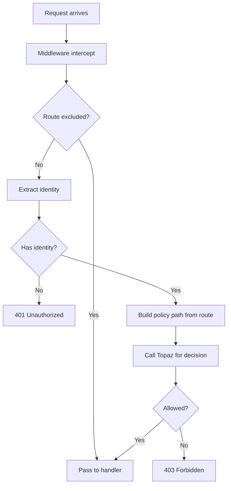

# How to Configure Authorization Middleware

Global request-level authorization that runs before route handlers.

## Basic Configuration

```python
from fastapi import FastAPI
from fastapi_topaz import TopazMiddleware

app = FastAPI()

app.add_middleware(
    TopazMiddleware,
    config=topaz_config,
    exclude_paths=[r"^/health$", r"^/metrics$", r"^/docs", r"^/openapi\.json$"],
)
```

## How It Works


```mermaid
flowchart TD
    A[Request arrives] --> B[Middleware intercept]
    B --> C{Route excluded?}
    C -->|Yes| D[Pass to handler]
    C -->|No| E[Extract identity]
    E --> F{Has identity?}
    F -->|No| G[401 Unauthorized]
    F -->|Yes| H[Build policy path from route]
    H --> I[Call Topaz for decision]
    I --> J{Allowed?}
    J -->|No| K[403 Forbidden]
    J -->|Yes| D
```

## Excluding Routes

### By Path: `exclude_paths`

Each entry is a regular expression matched against the request path with `re.match`, so it is anchored at the start but not at the end:

```python
exclude_paths=[
    r"^/health$",        # exactly /health
    r"^/public/",        # /public/foo, /public/bar/baz
    r".*\.(css|js|png)$", # static assets anywhere
]
```

Without a trailing `$`, a pattern is a prefix: `r"^/health"` also excludes `/healthcheck`.

### By Method: `exclude_methods`

```python
exclude_methods=["OPTIONS", "HEAD"]  # the default
```

The list applies to every route. To exclude one method of one route, use a marker instead.

### Per Route: `@skip_middleware` and `SkipMiddleware`

```python
from fastapi import Depends
from fastapi_topaz import SkipMiddleware, skip_middleware

@app.get("/status")
@skip_middleware
async def status():
    ...

# A whole router, frontend routes included
app.include_router(public_router, prefix="/public", dependencies=[Depends(SkipMiddleware)])
```

`annotate_openapi`, `policy-diff` and the rights matrix report all of these routes as `skipped`. See [Routes the middleware skips](policy-generation.md#routes-the-middleware-skips).

## Policy Path Resolution

Routes automatically map to policy paths:

| Route | Method | Policy Path |
|-------|--------|-------------|
| `/documents` | GET | myapp.GET.documents |
| `/documents` | POST | myapp.POST.documents |
| `/documents/{id}` | GET | myapp.GET.documents.__id |
| `/api/v1/users/{user_id}` | PUT | myapp.PUT.api.v1.users.__user_id |

Path parameters become `__paramname`.

### Normalizing Hyphenated Paths

Rego identifiers cannot contain hyphens. If your API uses hyphenated paths
like `/aircraft-programs`, the generated policy path `myapp.GET.aircraft-programs`
will be invalid.

Use `policy_path_normalizer` to fix this:

```python
from fastapi_topaz import TopazConfig, normalize_hyphens

config = TopazConfig(
    ...
    policy_path_normalizer=normalize_hyphens,
)
```

| Route | Without normalizer | With `normalize_hyphens` |
|-------|--------------------|--------------------------|
| `/aircraft-programs` | myapp.GET.aircraft-programs | myapp.GET.aircraft_programs |
| `/user-docs/{doc-id}` | myapp.GET.user-docs.__doc-id | myapp.GET.user_docs.__doc_id |

For custom normalization, pass any `Callable[[str], str]`:

```python
config = TopazConfig(
    ...
    policy_path_normalizer=lambda path: path.replace("-", "_").lower(),
)
```

## Combining with Dependencies

Middleware for broad protection, dependencies for specific checks:

```python
# Middleware protects all non-excluded routes
app.add_middleware(
    TopazMiddleware,
    config=topaz_config,
    exclude_paths=[r"^/health$"],
)

# Dependencies for additional ReBAC checks
@app.get("/documents/{id}")
async def get_document(
    id: int,
    _: None = Depends(
        require_rebac_allowed(topaz_config, "document", "can_read")
    ),
):
    ...
```

## Configuration Options

| Parameter | Type | Default | Description |
|-----------|------|---------|-------------|
| `config` | `TopazConfig` | required | Configuration instance |
| `exclude_paths` | `list[str]` | `None` | Regexes for request paths to skip |
| `exclude_methods` | `list[str]` | `["OPTIONS", "HEAD"]` | HTTP methods to skip |
| `on_missing_identity` | `"deny"` or `"anonymous"` | `"deny"` | `"deny"` answers 401; `"anonymous"` lets the policy decide |
| `on_denied` | `Callable[[Request, str], Response]` | `None` | Builds the 403 response; receives the policy path |
| `on_error` | `"deny"`, `"unavailable"` or `None` | `None` | Overrides `config.on_error` for the middleware; see below |
| `policies_dir` | path | `None` | Directory of `.rego` files for the explicit tier of the resolution chain |

## Custom Denial Response

```python
from fastapi import Request
from fastapi.responses import JSONResponse

def custom_denied(request: Request, policy_path: str) -> JSONResponse:
    return JSONResponse(status_code=403, content={"error": "You don't have permission"})

app.add_middleware(TopazMiddleware, config=topaz_config, on_denied=custom_denied)
```

## When the Authorizer Fails: `on_error`

When the Topaz call itself fails (authorizer unreachable, deadline exceeded, a policy that doesn't exist) and the circuit breaker gives no fallback decision, the response depends on `TopazConfig(on_error=...)`. The middleware and every dependency use the same setting:

| `on_error` | Response | Notes |
|------------|----------|-------|
| `"deny"` (default) | 403 `{"detail": "Forbidden"}`, or your `on_denied` response | Indistinguishable from a denial |
| `"unavailable"` | 503 `{"detail": "Authorization service unavailable"}` | `Retry-After` is set to the circuit breaker's `recovery_timeout` when one is configured |

Both fail closed: nothing is let through. Choose by what your clients and monitoring should see:

- **`"deny"`** keeps outages quiet for clients, and HTTP clients and proxies don't retry 403. But an outage shows up as a burst of 403s, which security monitoring may misread.
- **`"unavailable"`** tells clients and monitoring the truth, and 5xx alerting catches outages. Proxies, load balancers and HTTP clients may retry 503s; `Retry-After` tells them when.

```python
config = TopazConfig(..., on_error="unavailable")

# Or only for the middleware, keeping 403 in the dependencies
app.add_middleware(TopazMiddleware, config=config, on_error="unavailable")
```

With `expose_deny_reason=True`, the body also names the `policy`, the `source` and the `error` type.

## Mounted Sub-Applications

Mounted sub-apps (`app.mount("/sub", sub_app)`) match at the `Mount` itself, not at the routes inside the sub-app. The middleware therefore derives a prefix-only policy path (e.g. `myapp.GET.sub` for every request under `/sub/...`), losing the per-route granularity. If a sub-app needs per-route policies, add `TopazMiddleware` to the sub-app directly or protect its routes with dependencies.

## Frontend Routes

FastAPI frontend routes (`app.frontend("/app", directory="dist")`, or `router.frontend(...)` on an included router) are matched only when no regular route matches. Like mounts, they get a prefix-only policy path from their mount path: every request under `/app/...`, including SPA fallback paths, evaluates `myapp.GET.app`. To leave a frontend public, include its router with `dependencies=[Depends(SkipMiddleware)]` or add its prefix to `exclude_paths`.

With a root frontend (`app.frontend("/")`), a request that FastAPI answers with a trailing-slash redirect (e.g. `/items/` when only `/items` exists) is not checked against the frontend policy: FastAPI redirects before trying frontend routes, and the redirected request is authorized on its own.

The middleware finds frontend routes through private FastAPI internals. If a FastAPI release changes them, the middleware fails closed: requests that match no regular route get `403` and an error is logged, instead of reaching an unauthorized frontend route.

## Performance

Middleware adds minimal overhead:
- Without cache: ~10-50ms (Topaz call)
- With cache hit: ~0.1-1ms

Route lookups for static paths (no path parameters) are cached internally per `(method, path)`, so repeated requests skip the route-matching scan. Parameterized routes are matched per request.

Use `DecisionCache` for frequently accessed routes:

```python
config = TopazConfig(
    ...
    decision_cache=DecisionCache(ttl_seconds=60, max_size=1000),
)
```

## See Also

- [Identity Providers](identity-providers.md) - Configure identity extraction
- [Audit Logging](audit-logging.md) - Log middleware decisions
- [Circuit Breaker](circuit-breaker.md) - Handle Topaz failures
