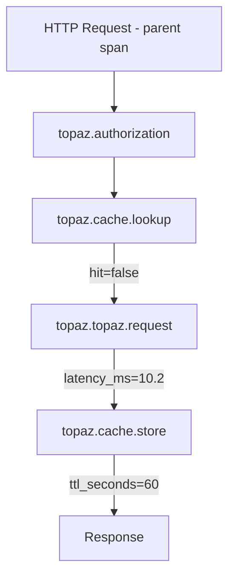

# How to Configure Observability

Prometheus metrics and OpenTelemetry tracing for monitoring authorization performance.

## Prometheus Metrics

### Basic Configuration

```python
from fastapi_topaz import TopazConfig, PrometheusMetrics

config = TopazConfig(
    authorizer_options=AuthorizerOptions(url="localhost:8282"),
    policy_path_root="myapp",
    identity_provider=get_identity,
    policy_instance_name="myapp",

    metrics=PrometheusMetrics(
        prefix="topaz",
        include_policy_path=False,
        include_object_type=False,
        include_relation=False,
        latency_buckets=[0.001, 0.005, 0.01, 0.025, 0.05, 0.1, 0.25, 0.5, 1.0, 2.5],
        exemplars_enabled=True,
    ),
)
```

### Expose Metrics Endpoint

```python
from prometheus_client import make_asgi_app

app = FastAPI()
metrics_app = make_asgi_app()
app.mount("/metrics", metrics_app)
```

### Available Metrics

| Metric | Type | Labels | Description |
|--------|------|--------|-------------|
| `topaz_auth_requests_total` | Counter | source, decision, check_type | Total authorization requests |
| `topaz_cache_hits_total` | Counter | source | Cache hits |
| `topaz_cache_misses_total` | Counter | source | Cache misses |
| `topaz_fallback_total` | Counter | strategy, cache_hit, decision | Circuit breaker fallbacks |
| `topaz_errors_total` | Counter | error_type | Authorization errors |
| `topaz_circuit_transitions_total` | Counter | from_state, to_state | Circuit state changes |
| `topaz_circuit_state` | Gauge | - | Current circuit state (0=closed, 1=open, 2=half_open) |
| `topaz_auth_latency_seconds` | Histogram | source, cached | End-to-end latency |
| `topaz_topaz_latency_seconds` | Histogram | - | Topaz call latency |

### Example Output

```prometheus
topaz_auth_requests_total{source="middleware",decision="allowed",check_type="policy"} 1523
topaz_auth_requests_total{source="middleware",decision="denied",check_type="policy"} 42
topaz_cache_hits_total{source="middleware"} 1205
topaz_auth_latency_seconds_bucket{source="middleware",cached="true",le="0.001"} 950
topaz_circuit_state 0
```

## OpenTelemetry Tracing

### Basic Configuration

```python
from fastapi_topaz import TopazConfig, OTelTracing

config = TopazConfig(
    ...
    tracing=OTelTracing(
        trace_all_checks=True,
        trace_cache_operations=True,
        include_identity=False,
        include_policy_path=False,
        include_resource_context=False,
        span_name_prefix="topaz",
    ),
)
```

### Setup with OTel SDK

```python
from opentelemetry import trace
from opentelemetry.sdk.trace import TracerProvider
from opentelemetry.sdk.trace.export import BatchSpanProcessor
from opentelemetry.exporter.otlp.proto.grpc.trace_exporter import OTLPSpanExporter

provider = TracerProvider()
provider.add_span_processor(BatchSpanProcessor(OTLPSpanExporter()))
trace.set_tracer_provider(provider)

# TopazConfig inherits global tracer
config = TopazConfig(
    ...
    tracing=OTelTracing(),
)
```

### Span Structure



### Span Attributes

| Attribute | Type | Privacy | Description |
|-----------|------|---------|-------------|
| topaz.source | string | Safe | middleware, dependency, manual |
| topaz.check_type | string | Safe | policy, rebac |
| topaz.decision | string | Safe | allowed, denied |
| topaz.cached | bool | Safe | Whether from cache |
| topaz.latency_ms | float | Safe | Total time |
| topaz.identity | string | Opt-in | User identity |
| topaz.policy_path | string | Opt-in | Full policy path |

## Cross-Feature Integration

### Metrics + Traces (Exemplars)

Link metrics to traces:

```python
config = TopazConfig(
    ...
    metrics=PrometheusMetrics(exemplars_enabled=True),
    tracing=OTelTracing(),
)
```

Result:
```prometheus
topaz_auth_latency_seconds_bucket{...} 42 # {trace_id="abc123"}
```

### Audit Logging

Trace ID in logs:
```json
{
  "event": "authorization.middleware.allowed",
  "trace_id": "abc123def456",
  "span_id": "789xyz"
}
```

## Configuration Summary

```python
config = TopazConfig(
    authorizer_options=AuthorizerOptions(url="localhost:8282"),
    policy_path_root="myapp",
    identity_provider=get_identity,
    policy_instance_name="myapp",

    decision_cache=DecisionCache(ttl_seconds=60),
    circuit_breaker=CircuitBreaker(fallback="cache_then_deny"),

    metrics=PrometheusMetrics(prefix="topaz"),
    tracing=OTelTracing(include_identity=False),
    audit_logger=AuditLogger(),
)
```

## See Also

- [Circuit Breaker](circuit-breaker.md) - Resilience metrics
- [Audit Logging](audit-logging.md) - Trace correlation
