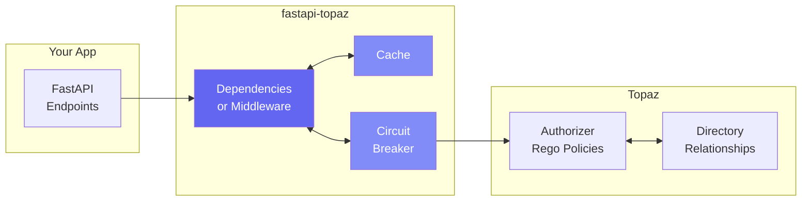

# FastAPI-Topaz

**Production-ready authorization for FastAPI using Topaz.**

Add fine-grained authorization to your FastAPI application with native dependency injection, caching, circuit breakers, and observability built in.



## Quick Start

```python
from fastapi import Depends, FastAPI, Request
from fastapi_topaz import (
    AuthorizerOptions,
    Identity,
    IdentityType,
    TopazConfig,
    require_rebac_allowed,
)

config = TopazConfig(
    authorizer_options=AuthorizerOptions(url="localhost:8282"),
    policy_path_root="myapp",
    identity_provider=lambda r: Identity(
        type=IdentityType.IDENTITY_TYPE_SUB, value=r.state.user_id
    ),
    policy_instance_name="myapp",
)

app = FastAPI()

@app.get("/documents/{id}")
async def get_document(
    id: int,
    request: Request,
    _: None = Depends(require_rebac_allowed(config, "document", "can_read")),
):
    return {"id": id, "title": "My Document"}
```

## Installation

```bash
pip install fastapi-topaz
```

## Features

<div class="grid cards" markdown>

-   :material-shield-check:{ .lg .middle } **RBAC, ABAC & ReBAC**

    ---

    Support for all authorization models: role-based, attribute-based, and relationship-based.
    Combine them in a single Rego policy for fine-grained control.

-   :material-code-tags:{ .lg .middle } **Dependencies & Middleware**

    ---

    Native FastAPI integration via `Depends()` or global `TopazMiddleware`.
    Auto-generate policy paths or specify them explicitly.

-   :material-lightning-bolt:{ .lg .middle } **Decision Caching**

    ---

    TTL-based caching reduces Topaz calls by 90%+.
    Configurable per policy path with automatic invalidation.

-   :material-shield-refresh:{ .lg .middle } **Circuit Breaker**

    ---

    Graceful degradation when Topaz is unavailable.
    Serve stale cache, fail-open, or fail-closed.

-   :material-chart-line:{ .lg .middle } **Observability**

    ---

    Prometheus metrics and OpenTelemetry tracing.
    Monitor latency, cache hit rates, and circuit state.

-   :material-file-document:{ .lg .middle } **Audit Logging**

    ---

    Structured JSON logs for every authorization decision.
    Compliance-ready with request correlation.

</div>

## Start Here

<div class="grid cards" markdown>

-   :material-school:{ .lg .middle } **New to fastapi-topaz?**

    ---

    Start with the Getting Started tutorial to add authorization in 15 minutes.

    [:octicons-arrow-right-24: Getting Started](tutorials/getting-started.md)

-   :material-application:{ .lg .middle } **Want a complete example?**

    ---

    Follow the Example App tutorials with real OIDC and database setup.

    [:octicons-arrow-right-24: Example App](tutorials/example-app/01-setup.md)

-   :material-book-open:{ .lg .middle } **Already using it?**

    ---

    Check the How-to Guides for specific tasks and the API Reference.

    [:octicons-arrow-right-24: How-to Guides](how-to/identity-providers.md)

</div>

---

## Documentation Structure

This documentation follows the [Diataxis](https://diataxis.fr/) framework:

| Section | Purpose | Start Here |
|---------|---------|------------|
| **[Tutorials](tutorials/getting-started.md)** | Learning-oriented, step-by-step guides | [Getting Started](tutorials/getting-started.md) |
| **[How-to Guides](how-to/identity-providers.md)** | Task-oriented, solve specific problems | [Identity Providers](how-to/identity-providers.md) |
| **[Reference](reference/api.md)** | Technical specifications | [API Reference](reference/api.md) |
| **[Explanation](explanation/architecture.md)** | Understanding-oriented, concepts | [Architecture](explanation/architecture.md) |

---

## Feature Status

| Feature | Status | Documentation |
|---------|--------|---------------|
| Policy-based authorization | :white_check_mark: Stable | [API Reference](reference/api.md#require_policy_allowed) |
| ReBAC (relationship-based) | :white_check_mark: Stable | [API Reference](reference/api.md#require_rebac_allowed) |
| Auto policy path resolution | :white_check_mark: Stable | [API Reference](reference/api.md#require_policy_auto) |
| Decision caching | :white_check_mark: Stable | [API Reference](reference/api.md#decisioncache) |
| Circuit breaker | :white_check_mark: Stable | [Circuit Breaker](how-to/circuit-breaker.md) |
| Connection pooling | :white_check_mark: Stable | [Connection Pooling](how-to/connection-pooling.md) |
| Authorization middleware | :white_check_mark: Stable | [Middleware](how-to/middleware.md) |
| Audit logging | :white_check_mark: Stable | [Audit Logging](how-to/audit-logging.md) |
| Prometheus metrics | :white_check_mark: Stable | [Observability](how-to/observability.md) |
| OpenTelemetry tracing | :white_check_mark: Stable | [Observability](how-to/observability.md) |
| Testing utilities | :white_check_mark: Stable | [Testing](how-to/testing.md) |
| CLI tools | :white_check_mark: Stable | [CLI Reference](reference/cli.md) |
| Resource hierarchy | :white_check_mark: Stable | [Resource Hierarchy](how-to/resource-hierarchy.md) |
| Integration testing | :white_check_mark: Stable | [Integration Testing](how-to/integration-testing.md) |

---

## Requirements

- Python 3.9+
- FastAPI 0.100+
- Running [Topaz](https://www.topaz.sh/) instance

## External Resources

- [Topaz Documentation](https://www.topaz.sh/docs)
- [FastAPI Documentation](https://fastapi.tiangolo.com/)
- [Open Policy Agent (Rego)](https://www.openpolicyagent.org/docs/latest/policy-language/)
