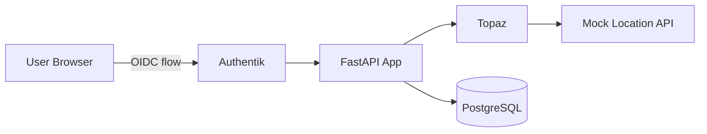

# Example Application Specification

Architecture and technical specification for the test webapp.

## Overview

Document management system demonstrating ABAC capabilities using fastapi-topaz middleware with Topaz authorizer, Authentik OIDC authentication, and geographic location-based access control.

## Architecture

### Components

| Component | Technology | Purpose |
|-----------|------------|---------|
| Webapp | FastAPI | Document management API |
| Topaz | Aserto Topaz | Authorization service |
| Authentik | goauthentik | OIDC identity provider |
| Mock Location API | FastAPI | Geographic access control |
| PostgreSQL | PostgreSQL 16 | Database (2 instances) |
| Frontend | HTMX + Alpine.js | Server-rendered UI |

### Service Communication



## Data Model

### Documents

| Column | Type | Description |
|--------|------|-------------|
| id | integer | Primary key |
| name | string | Document name |
| content | text | Document content |
| owner_id | string | User ID (from Authentik) |
| folder_id | integer | Parent folder |
| is_public | boolean | Public visibility |
| created_at | timestamp | Creation time |
| updated_at | timestamp | Last update |

### Folders

| Column | Type | Description |
|--------|------|-------------|
| id | integer | Primary key |
| name | string | Folder name |
| owner_id | string | User ID |
| parent_folder_id | integer | Parent folder |
| created_at | timestamp | Creation time |

### Shares

| Column | Type | Description |
|--------|------|-------------|
| document_id | integer | Document reference |
| user_id | string | Shared with user |
| permission | string | read or write |

### Users

| Column | Type | Description |
|--------|------|-------------|
| id | string | User ID (from Authentik sub) |
| email | string | Email address |
| name | string | Display name |

## Authorization Rules

### Document Access

| User | Read | Write | Delete | Share |
|------|------|-------|--------|-------|
| Owner | Yes | Yes | Yes | Yes |
| Write share | Yes | Yes | No | No |
| Read share | Yes | No | No | No |
| Public | Yes | No | No | No |
| Restricted country | No | No | No | No |

### Geographic Restrictions

Restricted countries: CN, KP, IR

Users in restricted countries are denied all document access.

## Policy Structure

```
policies/
  common.rego       # Common rules (ownership, shares)
  rebac.rego        # Relationship-based checks
  location.rego     # Geographic restrictions
```

### Policy Decisions

| Decision | Description |
|----------|-------------|
| `GET.api.documents.allowed` | Can list documents |
| `GET.api.documents.__id.allowed` | Can read document |
| `POST.api.documents.allowed` | Can create document |
| `PUT.api.documents.__id.allowed` | Can update document |
| `DELETE.api.documents.__id.allowed` | Can delete document |
| `check.can_read` | ReBAC read check |
| `check.can_write` | ReBAC write check |
| `check.can_share` | ReBAC share check |
| `check.can_delete` | ReBAC delete check |

## API Endpoints

| Method | Path | Description |
|--------|------|-------------|
| GET | /health | Health check |
| GET | /login | OIDC login |
| GET | /auth/callback | OIDC callback |
| GET | /logout | Logout |
| GET | /api/documents | List documents |
| POST | /api/documents | Create document |
| GET | /api/documents/{id} | Get document |
| PUT | /api/documents/{id} | Update document |
| DELETE | /api/documents/{id} | Delete document |
| POST | /api/shares | Share document |
| DELETE | /api/shares/{doc_id}/{email} | Revoke share |

## Docker Services

```yaml
services:
  postgres:
    image: postgres:16
    ports: ["5432:5432"]

  authentik-server:
    image: ghcr.io/goauthentik/server:latest
    ports: ["9000:9000"]

  topaz:
    image: ghcr.io/aserto-dev/topaz:latest
    ports: ["8282:8282", "8383:8383"]

  mock-location-api:
    build: ./mock-location-api
    ports: ["8001:8001"]

  webapp:
    build: .
    ports: ["8000:8000"]
```

## Test Users

| Username | Email | Password | Notes |
|----------|-------|----------|-------|
| alice | alice@example.com | password | Standard user |
| bob | bob@example.com | password | Standard user |
| charlie | charlie@example.com | password | May be geo-restricted |

## See Also

- [Setup Tutorial](../tutorials/example-app/01-setup.md) - Getting started
- [Architecture Explanation](../explanation/architecture.md) - Design decisions
