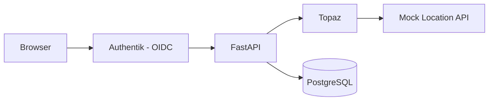

# Example App Setup

Get the FastAPI-Topaz test webapp running in 2 commands with automated Terraform setup.

## Prerequisites

- Docker and Docker Compose installed
- Make (optional, but recommended)
- Terraform - [Install](https://developer.hashicorp.com/terraform/install)

### Hosts File Configuration

Add to `/etc/hosts` (required for OIDC):

```
127.0.0.1 authentik-server
```

macOS/Linux:
```bash
echo "127.0.0.1 authentik-server" | sudo tee -a /etc/hosts
```

Windows (run as Administrator):
```powershell
Add-Content -Path C:\Windows\System32\drivers\etc\hosts -Value "127.0.0.1 authentik-server"
```

## Automated Setup (Recommended)

```bash
cd integration-tests
make setup-full
```

This command:
1. Builds all Docker images
2. Starts all services (FastAPI, Topaz, Authentik, PostgreSQL, Mock Location API)
3. Runs database migrations
4. Waits for Authentik to be ready
5. Uses Terraform to create OIDC provider, test users, OAuth2 credentials
6. Updates `.env` with OAuth client secret
7. Restarts webapp

Access http://localhost:8000 and login with test users.

### Test Users

| User | Email | Password |
|------|-------|----------|
| Alice | alice@example.com | password |
| Bob | bob@example.com | password |
| Charlie | charlie@example.com | password |

## Manual Setup (Step-by-Step)

### 1. Start Services

```bash
make build
make up
```

Wait ~15 seconds for services to start.

### 2. Run Database Migrations

```bash
make db-upgrade
```

### 3. Get Authentik Admin Password

```bash
make auth-password
```

Output: `adminpass` (from `env.authentik`)

### 4. Login to Authentik

Open http://authentik-server:9000

- Username: `akadmin`
- Password: (from step 3)

### 5. Run Terraform Setup

```bash
make tf-init
make tf-apply
```

### 6. Access Webapp

Open http://localhost:8000

Click "Login with Authentik" and use test credentials.

## Test Authorization Scenarios

### Test 1: Document Ownership

1. Login as alice@example.com
2. Create document "My Budget" (not public)
3. Logout
4. Login as bob@example.com
5. Bob does not see Alice's document

### Test 2: Sharing Documents

1. Login as alice@example.com
2. Create a document
3. Share with Bob (read permission)
4. Logout
5. Login as bob@example.com
6. Bob can view but not edit

### Test 3: Public Documents

1. Login as alice@example.com
2. Create document with "Make Public" checked
3. Logout
4. Login as bob@example.com
5. Bob can read public document

### Test 4: Geographic Restrictions

Check user location:

```bash
curl "http://localhost:8001/location?user_id=USER_SUB_FROM_AUTHENTIK"
```

If `country_code` is CN, KP, or IR, user is denied all access.

## Useful Commands

```bash
# View logs
make logs-webapp
make logs-authentik
make logs-topaz

# Restart services
make restart
docker-compose restart webapp

# Check health
make check-health

# Terraform
make tf-output        # Show OAuth credentials
make tf-destroy       # Remove OIDC config
make tf-apply         # Reapply config

# Database
make db-shell         # PostgreSQL shell

# Authentik
make auth-password    # Show admin password
make auth-shell       # Shell access
make wipe-auth        # Wipe Authentik data

# Reset everything
make clean
make setup-full
```

## Troubleshooting

### Services not starting

```bash
make status
make logs
```

### Webapp cannot connect to Authentik

```bash
docker-compose ps authentik-server
cat .env | grep OIDC
docker-compose restart webapp
```

### Authorization not working

```bash
make logs-topaz
make topaz-reload
```

### Terraform errors

```bash
curl http://localhost:9000/-/health/ready/
grep AUTHENTIK_BOOTSTRAP_TOKEN env.authentik
make tf-init
```

## Architecture



Components:
- FastAPI: Document management app
- Topaz: Open-source authorization service
- Authentik: OIDC identity provider
- Mock Location API: Geographic access control
- PostgreSQL: Database (2 instances)

## Next Steps

- [Authentication Tutorial](02-authentication.md) - SSO implementation details
- [Authorization Tutorial](03-authorization.md) - Policy and ReBAC setup
- [Sharing Documents](04-sharing-documents.md) - Permission-based sharing
