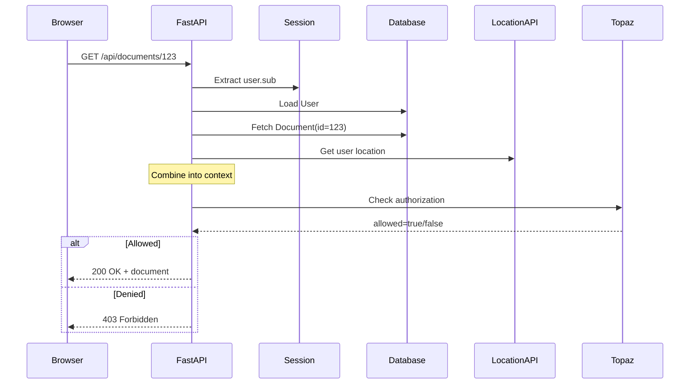

# Authorization Tutorial

Learn authorization by building owner-protected endpoints and document sharing.

**Time:** 45 minutes

## What You Will Learn

- Difference between authentication and authorization
- Owner-protected endpoints
- Writing custom policy rules
- Testing authorization

## Prerequisites

- Services running (`make up`)
- Authentication working (completed previous tutorial)
- Test cookies available (`make cookies`)

## Part 1: Authentication vs Authorization

### Step 1: Create Endpoints

File: `webapp/app/routers/tutorial.py`

```python
from fastapi import APIRouter, Depends
from typing import Annotated
from app.auth import get_current_user
from app.models import User

router = APIRouter()

@router.get("/tutorial/public")
async def public_endpoint():
    """No protection - anyone can access."""
    return {"message": "This is public"}

@router.get("/tutorial/authenticated")
async def authenticated_endpoint(
    current_user: Annotated[User, Depends(get_current_user)]
):
    """Authentication only - any logged-in user."""
    return {"message": f"Hello {current_user.name}"}
```

Register in `main.py`:
```python
from app.routers import tutorial
app.include_router(tutorial.router, tags=["tutorial"])
```

### Step 2: Test the Difference

```bash
docker-compose build webapp && docker-compose up -d webapp

# Public - no auth needed
curl http://localhost:8000/tutorial/public
# Response: 200 OK

# Authenticated - needs login
curl http://localhost:8000/tutorial/authenticated
# Response: 401 Unauthorized

# With cookie
curl -H "Cookie: session=$ALICE_SESSION_COOKIE" \
  http://localhost:8000/tutorial/authenticated
# Response: 200 OK
```

Authentication checks if user is logged in. All logged-in users can access.

## Part 2: Adding Authorization

### Step 3: Create Owner-Protected Endpoint

```python
from fastapi_topaz import require_rebac_allowed
from app.topaz_integration import topaz_config
from app.database import get_db
from app.models import Document
from sqlalchemy.orm import Session

@router.get("/tutorial/my-documents")
async def my_documents(
    current_user: Annotated[User, Depends(get_current_user)],
    db: Annotated[Session, Depends(get_db)]
):
    """Authorization - only YOUR documents."""
    docs = db.query(Document).filter(
        Document.owner_id == current_user.id
    ).all()

    return {
        "count": len(docs),
        "documents": [{"id": d.id, "name": d.name} for d in docs]
    }
```

### Step 4: Test User Isolation

```bash
# Alice creates a document
curl -X POST -H "Cookie: session=$ALICE_SESSION_COOKIE" \
  -H "Content-Type: application/json" \
  -d '{"name": "Alice Doc", "content": "test"}' \
  http://localhost:8000/api/documents

# Alice sees her document
curl -H "Cookie: session=$ALICE_SESSION_COOKIE" \
  http://localhost:8000/tutorial/my-documents
# Response: count: 1

# Bob sees nothing
curl -H "Cookie: session=$BOB_SESSION_COOKIE" \
  http://localhost:8000/tutorial/my-documents
# Response: count: 0
```

Authorization filters data by user.

## Part 3: Policy-Based Authorization

### Step 5: Examine Policy

File: `policies/common.rego`

```rego
package webapp.common

user_sub := input.resource.current_user.sub

is_document_owner if {
    user_sub
    input.resource.owner_id == user_sub
}

can_write_document if {
    not user_in_restricted_country
    is_document_owner
}
```

The policy:
1. Extracts `user_sub` from context
2. Compares with `owner_id` from document
3. Returns true/false

### Step 6: Write Your First Policy Rule

Add to `policies/common.rego`:

```rego
is_my_document if {
    user_sub
    input.resource.owner_id == user_sub
}
```

Add to `policies/rebac.rego`:

```rego
can_view_details if {
    input.resource.object_type == "document"
    common.is_my_document
}

allowed if {
    input.resource.relation == "can_view_details"
    can_view_details
}
```

### Step 7: Use the Policy

```python
@router.get("/tutorial/document-details/{id}")
async def document_details(
    id: int,
    _: None = Depends(require_rebac_allowed(
        topaz_config, "document", "can_view_details"
    )),
    db: Annotated[Session, Depends(get_db)]
):
    document = db.query(Document).filter(Document.id == id).first()
    return {
        "id": document.id,
        "name": document.name,
        "owner": document.owner_id,
    }
```

### Step 8: Test Your Policy

```bash
docker-compose restart topaz webapp && sleep 3

# Create document as Alice
DOC_ID=$(curl -X POST -H "Cookie: session=$ALICE_SESSION_COOKIE" \
  -H "Content-Type: application/json" \
  -d '{"name": "Test", "content": "test"}' \
  http://localhost:8000/api/documents | jq -r '.id')

# Alice can view (owner)
curl -H "Cookie: session=$ALICE_SESSION_COOKIE" \
  http://localhost:8000/tutorial/document-details/$DOC_ID
# Response: 200 OK

# Bob cannot view (not owner)
curl -H "Cookie: session=$BOB_SESSION_COOKIE" \
  http://localhost:8000/tutorial/document-details/$DOC_ID
# Response: 403 Forbidden
```

## Part 4: Attribute-Based Rules

### Step 9: Geographic Restrictions

In `policies/common.rego`:

```rego
restricted_countries := {"CN", "KP", "IR"}

user_in_restricted_country if {
    input.resource.user_location.country_code
    restricted_countries[input.resource.user_location.country_code]
}

can_write_document if {
    not user_in_restricted_country
    is_document_owner
}
```

The `resource_context_provider` fetches:
- User location from mock API
- Document owner/shares from database
- User identity from session

All combined into policy input.

## Part 5: Understanding the Flow



## Summary

| Concept | Description |
|---------|-------------|
| Authentication vs Authorization | WHO (identity) vs WHAT (permissions) |
| ReBAC | Ownership and relationships |
| ABAC | Attributes and context |
| Topaz Integration | Policy evaluation with OPA and Rego |

## Next Steps

- [Sharing Documents](04-sharing-documents.md) - Implement document sharing
- [Authorization Models](../../explanation/authorization-models.md) - Deep dive into RBAC/ABAC/ReBAC
- [API Reference](../../reference/api.md) - Complete API documentation
