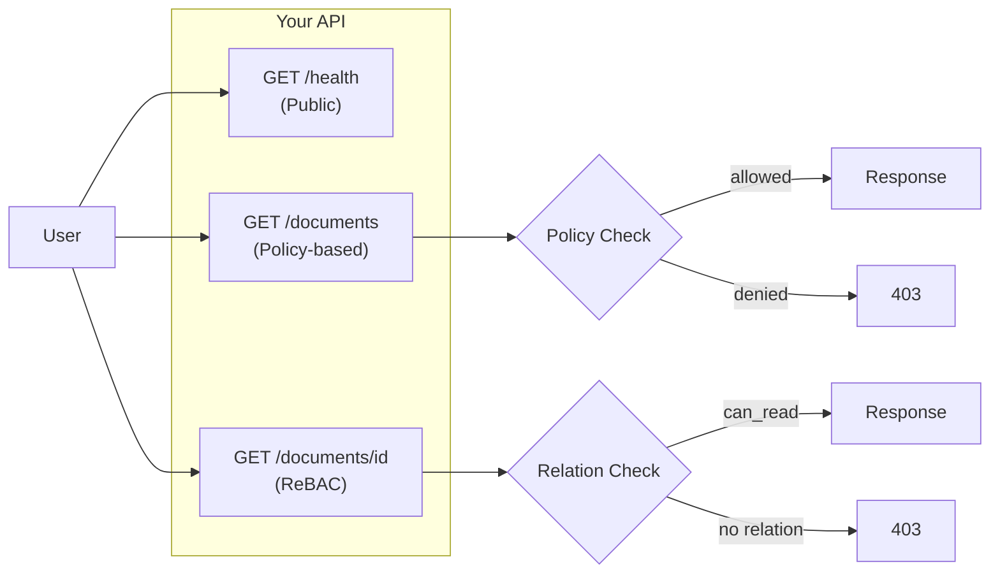
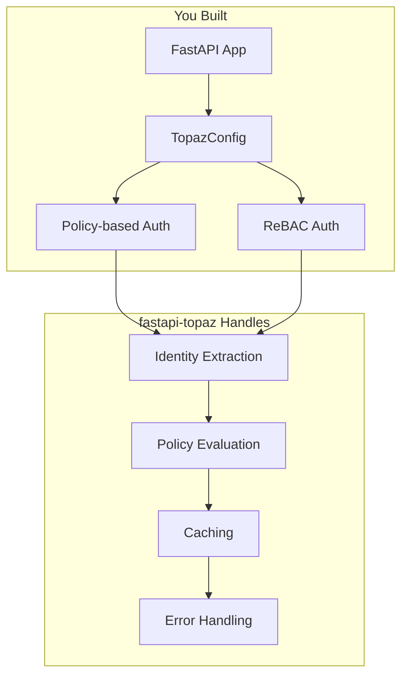

# Getting Started with FastAPI-Topaz

Add Topaz authorization to a FastAPI application in 15 minutes.

## What You'll Build

You're building a document management API. Some endpoints are public, others require authentication, and some need fine-grained permission checks on specific documents.



By the end of this tutorial, you'll have:

- **Public endpoint** - No authorization needed (`/health`)
- **Policy-based endpoint** - Check if user can access a resource type (`/documents`)
- **ReBAC endpoint** - Check if user can access a specific resource (`/documents/{id}`)

## Prerequisites

- Python 3.9+
- FastAPI 0.100+
- Running Topaz instance ([Install Topaz](https://www.topaz.sh/docs/getting-started))

!!! tip "Don't have Topaz running?"
    You can start a local Topaz instance with Docker:
    ```bash
    docker run -d -p 8282:8282 -p 8383:8383 ghcr.io/aserto-dev/topaz:latest run
    ```

## Step 1: Install Dependencies

```bash
pip install fastapi-topaz uvicorn
```

!!! note "Why fastapi-topaz?"
    - **Native FastAPI integration** - Uses dependency injection, not decorators
    - **Production-ready** - Built-in caching, circuit breaker, observability
    - **Flexible** - Policy-based, ReBAC, or both

## Step 2: Create Configuration

Create `auth.py` to configure the Topaz connection and identity extraction:

```python
from fastapi import Request
from fastapi_topaz import (
    AuthorizerOptions,
    Identity,
    IdentityType,
    TopazConfig,
)


def identity_provider(request: Request) -> Identity:
    """
    Extract user identity from request.

    In a real app, this would decode a JWT, validate a session,
    or use your authentication system.
    """
    user_id = request.headers.get("X-User-ID")

    if not user_id:
        # Anonymous user - let the policy decide what they can do
        return Identity(type=IdentityType.IDENTITY_TYPE_NONE)

    return Identity(
        type=IdentityType.IDENTITY_TYPE_SUB,
        value=user_id,
    )


def resource_context_provider(request: Request) -> dict:
    """
    Provide additional context for policy evaluation.

    This context is available in Rego as `input.resource.*`
    """
    return {
        **request.path_params,  # Include path params like {id}
        "method": request.method,
    }


# Create the configuration once at startup
topaz_config = TopazConfig(
    authorizer_options=AuthorizerOptions(
        url="localhost:8282",  # Topaz gRPC port
    ),
    policy_path_root="myapp",  # Root package in your Rego policies
    identity_provider=identity_provider,
    policy_instance_name="myapp",
    resource_context_provider=resource_context_provider,
)
```

!!! info "What's happening here?"
    - **`identity_provider`** - Extracts the user from each request (you'll replace this with your auth system)
    - **`resource_context_provider`** - Adds request context that Rego policies can use
    - **`TopazConfig`** - Central configuration used by all authorization checks

## Step 3: Create Your API

Create `main.py` with three endpoints demonstrating different authorization patterns:

```python
from fastapi import Depends, FastAPI, HTTPException, Request
from fastapi_topaz import require_policy_allowed, require_rebac_allowed

from auth import topaz_config

app = FastAPI(title="Document API")

# Sample data
DOCUMENTS = {
    1: {"id": 1, "title": "Public Doc", "owner": "alice"},
    2: {"id": 2, "title": "Private Doc", "owner": "bob"},
}


@app.get("/health")
async def health():
    """
    Public endpoint - no authorization required.

    Use this pattern for health checks, static assets, etc.
    """
    return {"status": "ok"}


@app.get("/documents")
async def list_documents(
    request: Request,
    _: None = Depends(
        require_policy_allowed(topaz_config, "myapp.GET.documents")
    ),
):
    """
    Policy-based authorization.

    Checks: "Can this user list documents in general?"
    This doesn't check access to specific documents, just the action.
    """
    return {"documents": list(DOCUMENTS.values())}


@app.get("/documents/{id}")
async def get_document(
    id: int,
    request: Request,
    _: None = Depends(
        require_rebac_allowed(topaz_config, "document", "can_read")
    ),
):
    """
    ReBAC (Relationship-Based) authorization.

    Checks: "Can this user read THIS specific document?"
    Uses Topaz directory to check user->document relationships.
    """
    doc = DOCUMENTS.get(id)
    if not doc:
        raise HTTPException(status_code=404, detail="Not found")
    return doc
```

!!! tip "Understanding the two authorization patterns"
    - **`require_policy_allowed`** - "Can user X do action Y?" (role-based)
    - **`require_rebac_allowed`** - "Can user X do action Y on resource Z?" (relationship-based)

## Step 4: Create Topaz Policy

Create `policy.rego` for your Topaz instance. This defines the authorization rules:

```rego
package myapp

import rego.v1

# Default: deny access
default allowed := false

# Policy-based: Allow authenticated users to list documents
allowed if {
    input.policy.path == "myapp.GET.documents"
    input.identity.type != 0  # Not anonymous
}

# ReBAC check endpoint - evaluates relationship checks
check.allowed if {
    # Allow if user is the document owner
    input.resource.owner_id == input.identity.value
}

check.allowed if {
    # Allow if document is public
    input.resource.is_public == true
}

check.allowed if {
    # Allow if user has explicit can_read relation (from Topaz directory)
    ds.check({
        "object_type": input.resource.object_type,
        "object_id": input.resource.object_id,
        "relation": input.resource.relation,
        "subject_type": "user",
        "subject_id": input.identity.value,
    })
}
```

!!! info "How policies work"
    - **`myapp.GET.documents`** - Policy path for listing documents
    - **`myapp.check`** - Special path for ReBAC relation checks
    - **`input.identity`** - The user from `identity_provider`
    - **`input.resource`** - Context from `resource_context_provider`

## Step 5: Run and Test

Start your application:

```bash
uvicorn main:app --reload
```

Test the endpoints:

```bash
# Health check - no auth needed
curl http://localhost:8000/health
# Response: {"status": "ok"}

# List documents - needs authenticated user
curl -H "X-User-ID: alice" http://localhost:8000/documents
# Response: {"documents": [...]}

# Without auth header - should fail
curl http://localhost:8000/documents
# Response: 403 Forbidden

# Get specific document - needs can_read relation
curl -H "X-User-ID: alice" http://localhost:8000/documents/1
# Response: {"id": 1, "title": "Public Doc", "owner": "alice"}
```

## What You've Learned



You've successfully added authorization that:

- **Extracts identity** from requests (replace with your auth system)
- **Checks policies** for general permissions
- **Checks relationships** for resource-specific permissions
- **Returns 403** automatically when denied

## Next Steps

<div class="grid cards" markdown>

-   :material-account-key: **Add Real Authentication**

    ---

    Connect to your identity provider (JWT, OAuth, sessions).

    [:octicons-arrow-right-24: Identity Providers](../how-to/identity-providers.md)

-   :material-test-tube: **Test Your Authorization**

    ---

    Mock authorization in unit tests without Topaz.

    [:octicons-arrow-right-24: Testing Guide](../how-to/testing.md)

-   :material-speedometer: **Add Caching**

    ---

    Reduce latency with decision caching.

    [:octicons-arrow-right-24: API Reference](../reference/api.md#decisioncache)

-   :material-application: **Full Example App**

    ---

    Complete app with OIDC, database, and sharing.

    [:octicons-arrow-right-24: Example App Tutorial](example-app/01-setup.md)

</div>
