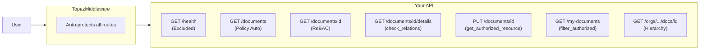
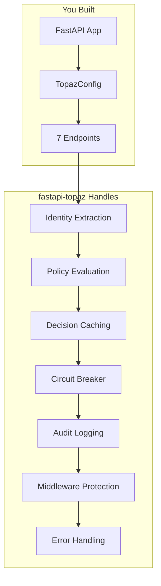

# Getting Started with FastAPI-Topaz

Add Topaz authorization to a FastAPI application in 15 minutes.

## What You'll Build

A document management API demonstrating every authorization pattern fastapi-topaz offers:


```mermaid
flowchart LR
    subgraph middleware ["TopazMiddleware"]
        direction TB
        M["Auto-protects all routes"]
    end

    subgraph api ["Your API"]
        H["GET /health<br/>(Excluded)"]
        L["GET /documents<br/>(Policy Auto)"]
        D["GET /documents/id<br/>(ReBAC)"]
        DT["GET /documents/id/details<br/>(check_relations)"]
        U["PUT /documents/id<br/>(get_authorized_resource)"]
        F["GET /my-documents<br/>(filter_authorized)"]
        HR["GET /orgs/.../docs/id<br/>(Hierarchy)"]
    end

    U2[User] --> middleware --> api
```

By the end of this tutorial, you'll have:

- **Middleware** - Global route protection with `TopazMiddleware`
- **Policy-based endpoint** - Auto-generated policy paths with `require_policy_auto`
- **ReBAC endpoint** - Relationship-based access with `require_rebac_allowed`
- **Permission introspection** - Non-raising `check_relations` for UI
- **Fetch-then-authorize** - `get_authorized_resource` pattern
- **Batch filtering** - `filter_authorized_resources` for lists
- **Hierarchy checks** - `require_rebac_hierarchy` for nested resources
- **Caching** - `DecisionCache` for reduced latency
- **Circuit breaker** - `CircuitBreaker` for graceful degradation
- **Audit logging** - `AuditLogger` for structured logs
- **Lifecycle management** - Async context manager with `close()`

## Prerequisites

- Python 3.9+
- FastAPI 0.100+
- Running Topaz instance ([Install Topaz](https://www.topaz.sh/docs/getting-started))

!!! tip "Don't have Topaz running?"
    You can start a local Topaz instance with Docker:
    ```bash
    docker run -d -p 8282:8282 -p 8383:8383 ghcr.io/aserto-dev/topaz:latest run
    ```

## Step 1: Install Dependencies

```bash
pip install fastapi-topaz uvicorn
```

## Step 2: Create Configuration

Create `auth.py` with production-ready settings:

```python
from fastapi import Request
from fastapi_topaz import (
    AuditLogger,
    AuthorizerOptions,
    CircuitBreaker,
    DecisionCache,
    Identity,
    IdentityType,
    TopazConfig,
)


def identity_provider(request: Request) -> Identity:
    """
    Extract user identity from request.

    In a real app, this would decode a JWT, validate a session,
    or use your authentication system.
    """
    user_id = request.headers.get("X-User-ID")

    if not user_id:
        return Identity(type=IdentityType.IDENTITY_TYPE_NONE)

    return Identity(
        type=IdentityType.IDENTITY_TYPE_SUB,
        value=user_id,
    )


def resource_context_provider(request: Request) -> dict:
    """
    Provide additional context for policy evaluation.

    This context is available in Rego as `input.resource.*`
    """
    return {
        **request.path_params,
        "method": request.method,
    }


# Create the configuration once at startup
topaz_config = TopazConfig(
    authorizer_options=AuthorizerOptions(
        url="localhost:8282",
    ),
    policy_path_root="myapp",
    identity_provider=identity_provider,
    policy_instance_name="myapp",
    resource_context_provider=resource_context_provider,
    # Cache decisions for 30s to reduce Topaz calls
    decision_cache=DecisionCache(ttl_seconds=30, max_size=500),
    # Graceful degradation when Topaz is unavailable
    circuit_breaker=CircuitBreaker(
        failure_threshold=5,
        recovery_timeout=30,
        fallback="cache_then_deny",
    ),
    # Structured JSON audit logging for all decisions
    audit_logger=AuditLogger(),
)
```

!!! info "What's happening here?"
    - **`identity_provider`** - Extracts the user from each request
    - **`resource_context_provider`** - Adds request context for Rego policies
    - **`DecisionCache`** - Caches authorization results with TTL and LRU eviction
    - **`CircuitBreaker`** - If Topaz fails 5 times, serves cached decisions for 30s before retrying
    - **`AuditLogger`** - Emits structured JSON logs for every authorization decision

## Step 3: Create Your API

Create `main.py` demonstrating all authorization patterns:

```python
from fastapi import Depends, FastAPI, HTTPException, Request
from fastapi_topaz import (
    TopazMiddleware,
    filter_authorized_resources,
    get_authorized_resource,
    require_policy_auto,
    require_rebac_allowed,
    require_rebac_hierarchy,
    skip_middleware,
)

from auth import topaz_config

app = FastAPI(title="Document API")

# --- Global Middleware ---
# Auto-protects ALL routes; excluded paths skip authorization
app.add_middleware(
    TopazMiddleware,
    config=topaz_config,
    exclude_paths=[r"^/health$", r"^/docs.*", r"^/openapi.json$"],
)

# Sample data
DOCUMENTS = {
    1: {"id": 1, "title": "Public Doc", "owner": "alice"},
    2: {"id": 2, "title": "Private Doc", "owner": "bob"},
    3: {"id": 3, "title": "Shared Doc", "owner": "alice"},
}


# --- 1. Public endpoint (excluded from middleware) ---
@app.get("/health")
@skip_middleware
async def health():
    """No authorization required."""
    return {"status": "ok"}


# --- 2. Policy-based with auto-generated path ---
@app.get("/documents")
async def list_documents(
    request: Request,
    _: None = Depends(require_policy_auto(topaz_config)),
):
    """
    Auto-generates policy path: myapp.GET.documents
    Checks: "Can this user list documents?"
    """
    return {"documents": list(DOCUMENTS.values())}


# --- 3. ReBAC: relationship-based access ---
@app.get("/documents/{id}")
async def get_document(
    id: int,
    request: Request,
    _: None = Depends(
        require_rebac_allowed(topaz_config, "document", "can_read")
    ),
):
    """
    Checks: "Can this user read THIS specific document?"
    Raises 403 if no can_read relation exists.
    """
    doc = DOCUMENTS.get(id)
    if not doc:
        raise HTTPException(status_code=404, detail="Not found")
    return doc


# --- 4. Non-raising permission check for UI ---
@app.get("/documents/{id}/details")
async def document_details(id: int, request: Request):
    """
    Uses check_relations() to return permissions without raising.
    Useful for showing/hiding UI buttons.
    """
    doc = DOCUMENTS.get(id)
    if not doc:
        raise HTTPException(status_code=404, detail="Not found")

    permissions = await topaz_config.check_relations(
        request,
        object_type="document",
        object_id=str(id),
        relations=["can_read", "can_write", "can_delete"],
    )
    return {"document": doc, "permissions": permissions}


# --- 5. Fetch-then-authorize pattern ---
def fetch_document(request: Request):
    """Fetch resource; returns None if not found."""
    doc_id = int(request.path_params.get("id", 0))
    return DOCUMENTS.get(doc_id)


@app.put("/documents/{id}")
async def update_document(
    document=Depends(
        get_authorized_resource(
            topaz_config, fetch_document, "document", "can_write"
        )
    ),
):
    """
    Fetches the document first, then checks can_write.
    Returns 404 if not found, 403 if not authorized.
    """
    return {"updated": document["title"]}


# --- 6. Batch filtering ---
@app.get("/my-documents")
async def my_documents(
    request: Request,
    filter_fn=Depends(
        filter_authorized_resources(topaz_config, "document", "can_read")
    ),
):
    """
    Checks can_read on each document concurrently.
    Returns only authorized documents.
    """
    authorized = await filter_fn(list(DOCUMENTS.values()))
    return {"documents": authorized}


# --- 7. Hierarchical ReBAC ---
@app.get("/orgs/{org_id}/projects/{proj_id}/docs/{doc_id}")
async def get_nested_doc(
    org_id: str,
    proj_id: str,
    doc_id: str,
    request: Request,
    _=Depends(
        require_rebac_hierarchy(
            topaz_config,
            [
                ("organization", "org_id", "member"),
                ("project", "proj_id", "viewer"),
                ("document", "doc_id", "can_read"),
            ],
        )
    ),
):
    """
    Checks organization membership, project access, AND document read.
    All three must pass (mode="all" is the default).
    """
    return {"org": org_id, "project": proj_id, "doc": doc_id}


# --- Lifecycle ---
@app.on_event("shutdown")
async def shutdown():
    """Release cache, circuit breaker, and pool resources."""
    await topaz_config.close()
```

!!! tip "Understanding the authorization patterns"
    | Pattern | Use When |
    |---------|----------|
    | `require_policy_auto` | General action checks (list, create) |
    | `require_rebac_allowed` | Access to a specific resource |
    | `check_relations` | UI permission introspection (non-raising) |
    | `get_authorized_resource` | Fetch + authorize in one dependency |
    | `filter_authorized_resources` | Filter lists to authorized items |
    | `require_rebac_hierarchy` | Nested resources (org/project/doc) |
    | `TopazMiddleware` | Protect all routes without `Depends` |

## Step 4: Create Topaz Policy

Create `policy.rego` for your Topaz instance:

```rego
package myapp

import rego.v1

# Default: deny access
default allowed := false

# Allow authenticated users to list documents
allowed if {
    input.policy.path == "myapp.GET.documents"
    input.identity.type != 0
}

# Allow authenticated users to access my-documents
allowed if {
    input.policy.path == "myapp.GET.my_documents"
    input.identity.type != 0
}

# ReBAC check endpoint
check.allowed if {
    input.resource.owner_id == input.identity.value
}

check.allowed if {
    input.resource.is_public == true
}

check.allowed if {
    ds.check({
        "object_type": input.resource.object_type,
        "object_id": input.resource.object_id,
        "relation": input.resource.relation,
        "subject_type": "user",
        "subject_id": input.identity.value,
    })
}
```

## Step 5: Run and Test

Start your application:

```bash
uvicorn main:app --reload
```

Test the endpoints:

```bash
# Health check - excluded from middleware
curl http://localhost:8000/health

# List documents - auto-generated policy path
curl -H "X-User-ID: alice" http://localhost:8000/documents

# Get specific document - ReBAC check
curl -H "X-User-ID: alice" http://localhost:8000/documents/1

# Permission introspection - returns booleans, no 403
curl -H "X-User-ID: bob" http://localhost:8000/documents/2/details

# Update - fetch-then-authorize (403 if not can_write)
curl -X PUT -H "X-User-ID: alice" http://localhost:8000/documents/1

# Batch filter - only returns documents you can read
curl -H "X-User-ID: alice" http://localhost:8000/my-documents

# Hierarchy - checks org, project, and document access
curl -H "X-User-ID: alice" \
  http://localhost:8000/orgs/acme/projects/proj-1/docs/doc-1
```

## What You've Learned


```mermaid
flowchart TB
    subgraph "You Built"
        A[FastAPI App]
        B[TopazConfig]
        C[7 Endpoints]
    end

    subgraph "fastapi-topaz Handles"
        D[Identity Extraction]
        E[Policy Evaluation]
        F[Decision Caching]
        G[Circuit Breaker]
        H[Audit Logging]
        I[Middleware Protection]
        J[Error Handling]
    end

    A --> B --> C
    C --> D --> E
    E --> F --> G
    G --> H --> I --> J
```

You've built an API with:

- **Global middleware** that auto-protects routes without per-endpoint `Depends`
- **Auto-generated policy paths** from route definitions
- **ReBAC checks** for resource-specific permissions
- **Permission introspection** for UI patterns (non-raising)
- **Fetch-then-authorize** to combine resource loading with authz
- **Batch filtering** for authorized list endpoints
- **Hierarchical checks** for nested resources
- **Decision caching** to reduce Topaz calls
- **Circuit breaker** for resilience when Topaz is unavailable
- **Audit logging** for compliance and debugging
- **Lifecycle management** with proper shutdown

## Next Steps

<div class="grid cards" markdown>

-   :material-account-key: **Add Real Authentication**

    ---

    Connect to your identity provider (JWT, OAuth, sessions).

    [:octicons-arrow-right-24: Identity Providers](../how-to/identity-providers.md)

-   :material-test-tube: **Test Your Authorization**

    ---

    Mock authorization in unit tests without Topaz.

    [:octicons-arrow-right-24: Testing Guide](../how-to/testing.md)

-   :material-chart-line: **Add Observability**

    ---

    Add Prometheus metrics and OpenTelemetry tracing.

    [:octicons-arrow-right-24: API Reference](../reference/api.md#prometheusmetrics)

-   :material-application: **Full Example App**

    ---

    Complete app with OIDC, database, and sharing.

    [:octicons-arrow-right-24: Example App Tutorial](example-app/01-setup.md)

</div>
